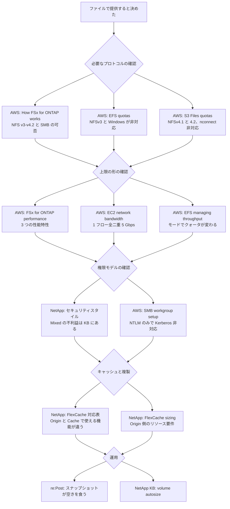

# ファイルプロトコル横断リソースマップ

[🏠 リポジトリトップ](../../../README.md) | [Reference](README.md)

---

## 結論

**ファイルプロトコルの一次情報は、サービスごとに別のガイドへ分かれています。** NFS の対応バージョンひとつを確かめるだけで、Amazon EFS のクォータページ、Amazon S3 Files の非対応事項ページ、FSx for ONTAP の仕組みのページを別々に開くことになります。

**この索引は、そこを 1 枚にまとめたものです。** [ブロックストレージ横断リソースマップ](block-storage-resource-map.md) のファイル側に当たります。

**出典の集め方は手作業ではありません。** [S3-Burst-on-ONTAP-Files](https://github.com/Yoshiki0705/S3-Burst-on-ONTAP-Files) が本文から実際に引用している URL を機械で抽出して供出したもの（コミット `0705ae5`、119 件）を、このリポジトリの節構成に振り分けています。**手書きの表で受け取ると片方だけが更新されるため、供出元は生成スクリプトです。**

**119 件すべてが 2026-09-06 時点で HTTP 200 を返しました。** 到達できなかったページはありません。ただし [到達確認の方法と限界](#到達確認の方法と限界) を読んでください。1 回の確認は生死の証拠になりません。

> **区分**: `documented` — 各行の論点は出典の記載に基づきます（2026-09-06 に確認）。**このリポジトリでは再測定していません。** 実測は供出元が持ちます。分担の原則は [プロジェクト間の引用索引](cross-repo-index.md) にあります。

---

## 読む順序

**同じ順序を表でも書きます。** 図が読めない環境でも辿れるようにするためです。

| # | 決めること | 先に読む |
|---|---|---|
| 1 | 必要なプロトコル | 各サービスの対応プロトコル（[一次情報](#手順を実行するときの一次情報)の「プロトコル」行） |
| 2 | 上限の形 | 上限がクライアント単位かフロー単位かファイルシステム単位か（同じ表の「上限」行） |
| 3 | 権限モデル | セキュリティスタイルと ID マッピング（[NetApp ドキュメント](#ontap-側の仕様を確認する-netapp-ドキュメント)） |
| 4 | キャッシュと複製 | FlexCache の対応表とサイジング（同上） |
| 5 | AWS 外からの到達 | Direct Connect と AWS Interconnect（[到達経路](#aws-外からの到達経路の一次情報)） |
| 6 | 運用で先に踏むもの | 容量とスナップショット（re:Post の節と、NetApp ドキュメントの「クローンと容量」） |

---

## 手順を実行するときの一次情報

### Amazon S3 Files

**GA が 2026-04 で、ドキュメントが 10 ページに分かれています。** 対応プロトコルと非対応事項は別ページです。

| 種類 | リソース | 論点 |
|------|----------|------|
| 概要 | [AWS: Working with Amazon S3 Files](https://docs.aws.amazon.com/AmazonS3/latest/userguide/s3-files.html) | 構成と 128 KiB の扱い。**バケットを EFS ファイルシステムとして見せる形**で、基盤は Amazon EFS |
| 制約 | [AWS: Unsupported features, limits, and quotas](https://docs.aws.amazon.com/AmazonS3/latest/userguide/s3-files-quotas.html) | **NFSv4.1 と NFSv4.2 に対応**。ACL・Kerberos・mandatory locking・`nconnect`・NFSv4.2 の任意機能が非対応。**機能説明のページは v4.0 も挙げており、記載が食い違います**（[後述](#資料間の食い違い)） |
| 前提 | [AWS: Prerequisites for S3 Files](https://docs.aws.amazon.com/AmazonS3/latest/userguide/s3-files-prereq-policies.html) | 汎用バケットであること。**リンク先バケットの S3 バージョニングが必須** |
| 同期 | [AWS: Synchronization](https://docs.aws.amazon.com/AmazonS3/latest/userguide/s3-files-synchronization.html) | バケット → ファイルシステムは S3 イベント通知の監視で通常数秒。**反映されるものとされないものがある点が設計に効きます** |
| 手順 | [AWS: Mounting S3 file systems on Amazon EC2](https://docs.aws.amazon.com/AmazonS3/latest/userguide/s3-files-mounting.html) | マウント手順 |
| 上限 | [AWS: Performance specifications](https://docs.aws.amazon.com/AmazonS3/latest/userguide/s3-files-performance.html) | 同期の方向ごとの所要時間と上限 |
| 課金 | [AWS: Metering](https://docs.aws.amazon.com/AmazonS3/latest/userguide/s3-files-metering.html) | **バケットから直接ストリームされる分にはファイルシステム側のデータ課金が発生しません。** 課金の境目がここにあります |
| 運用 | [AWS: Best practices](https://docs.aws.amazon.com/AmazonS3/latest/userguide/s3-files-best-practices.html) | `PendingExports` の増加が滞留の合図 |

### Amazon EFS

| 種類 | リソース | 論点 |
|------|----------|------|
| プロトコル | [AWS: What is Amazon EFS](https://docs.aws.amazon.com/efs/latest/ug/whatisefs.html) | **NFSv4.0 と NFSv4.1**。S3 Files の基盤でもあります |
| 制約 | [AWS: Amazon EFS quotas](https://docs.aws.amazon.com/efs/latest/ug/limits.html) | **NFSv2 と NFSv3 は非対応。ACL・Kerberos・mandatory locking も非対応。Windows での利用は非対応。** クライアント単位の読み書き合計は 500 MiBps で、**1,500 MiBps は Elastic スループットかつ EFS クライアント 2.0 以降または EFS CSI ドライバの場合に限られます** |
| 制約 | [AWS: Using NFS to mount EFS file systems](https://docs.aws.amazon.com/efs/latest/ug/mounting-fs-old.html) | **`nconnect` 非対応。Windows を実行する EC2 からのマウントは非対応**（「EFS は SMB 非対応」の根拠はこの行です） |
| 上限 | [AWS: Managing file system throughput](https://docs.aws.amazon.com/efs/latest/ug/managing-throughput.html) | **スループットモードでクライアント単位クォータが変わります。** 素マウントとマウントヘルパーで枠が違う理由がここにあります |
| 運用 | [AWS: Amazon EFS performance tips](https://docs.aws.amazon.com/efs/latest/ug/performance-tips.html) | 属性キャッシュを無効にするマウントオプションは性能への影響が大きいこと |

### FSx for ONTAP

| 種類 | リソース | 論点 |
|------|----------|------|
| プロトコル | [AWS: How Amazon FSx for NetApp ONTAP works](https://docs.aws.amazon.com/fsx/latest/ONTAPGuide/how-it-works-fsx-ontap.html) | **NFS v3 / v4.0 / v4.1 / v4.2 と SMB。iSCSI と NVMe/TCP も同じファイルシステムから** |
| プロトコル | [AWS: Accessing your FSx for ONTAP data](https://docs.aws.amazon.com/fsx/latest/ONTAPGuide/supported-fsx-clients.html) | 対応クライアントと SVM のエンドポイント種別 |
| 上限 | [AWS: FSx for ONTAP performance](https://docs.aws.amazon.com/fsx/latest/ONTAPGuide/performance.html) | **性能特性が 3 つに分かれること**（ネットワーク I/O、キャッシュサイズ、ディスク I/O）。前 2 つはスループット容量のみで決まります |
| 上限 | [AWS: Availability and deployment options](https://docs.aws.amazon.com/fsx/latest/ONTAPGuide/high-availability-AZ.html) | 世代ごとのスループット選択肢 |
| 容量 | [AWS: Managing storage capacity](https://docs.aws.amazon.com/fsx/latest/ONTAPGuide/managing-storage-capacity.html) | ワークロード別の典型的な削減率が公表されていること |
| 容量 | [AWS: Managing volumes（storage efficiency）](https://docs.aws.amazon.com/fsx/latest/ONTAPGuide/manage-vol-SE.html) | キャパシティプールへの階層化と効率化の関係 |
| 課金 | [AWS: FSx for ONTAP billing](https://docs.aws.amazon.com/fsx/latest/ONTAPGuide/FSxONTAP-Billing.html) | **SnapLock が独立したライセンス項目であること。** 課金項目の一覧はブログ側と粒度が違います |
| 保護 | [AWS: Protecting your data with volume backups](https://docs.aws.amazon.com/fsx/latest/ONTAPGuide/using-backups.html) | ボリュームバックアップの範囲 |
| 保護 | [AWS: DeleteVolumeOntapConfiguration](https://docs.aws.amazon.com/fsx/latest/APIReference/API_DeleteVolumeOntapConfiguration.html) | **ボリューム削除時の最終バックアップの既定値は API リファレンスから読み取れません。** 供出元は「撤去後に 4 件残った」という観測を持ちつつ、既定値は未確認としています |
| キャッシュ | [AWS: FlexCache による複製](https://docs.aws.amazon.com/fsx/latest/ONTAPGuide/using-flexcache.html) | FSx for ONTAP 上での FlexCache の位置づけ |
| キャッシュ | [AWS: FlexCache の作成](https://docs.aws.amazon.com/fsx/latest/ONTAPGuide/create-flexcache.html) | **作成に advanced 権限が必要**。`fsxadmin` の既定ロールで通らない操作があります |
| SMB | [AWS: SMB server workgroup setup](https://docs.aws.amazon.com/fsx/latest/ONTAPGuide/smb-server-workgroup-setup.html) | **workgroup モードは NTLM のみで Kerberos は非対応。** AD なしで SMB を出すときの上限がここです |
| ONTAP 連携 | [AWS: Managing resources using NetApp applications](https://docs.aws.amazon.com/fsx/latest/ONTAPGuide/managing-resources-ontap-apps.html) | AWS が管理する範囲と ONTAP 側の道具の境界 |

### FSx for ONTAP の S3 Access Point

**「ファイルを S3 API で読む」経路は、対応表と制約が別ページに分かれています。**

| 種類 | リソース | 論点 |
|------|----------|------|
| 制約 | [AWS: Restrictions, limitations, and naming rules](https://docs.aws.amazon.com/fsx/latest/ONTAPGuide/access-point-for-fsxn-restrictions-limitations-naming-rules.html) | 同一アカウント・同一リージョンなどの計画段階の制約 |
| 対応表 | [AWS: Object API support](https://docs.aws.amazon.com/fsx/latest/ONTAPGuide/access-points-for-fsxn-object-api-support.html) | どの S3 操作が通るか。**この表は AWS 自身が partial list と明記しています。ここから作った「非対応の一覧」は網羅ではありません** |
| 認可 | [AWS: Managing access](https://docs.aws.amazon.com/fsx/latest/ONTAPGuide/s3-ap-manage-access-fsxn.html) | **AWS 側と ONTAP 側の両方が許可する必要があること**（二層認可） |
| 参照 | [AWS: Referencing access points](https://docs.aws.amazon.com/fsx/latest/ONTAPGuide/referencing-access-points-for-fsxn.html) | virtual-hosted-style URI での参照形式 |
| ネットワーク | [AWS: Configuring network access](https://docs.aws.amazon.com/fsx/latest/ONTAPGuide/configuring-network-access-for-s3-access-points.html) | VPC エンドポイントの構成 |
| 切り分け | [AWS: Troubleshooting](https://docs.aws.amazon.com/fsx/latest/ONTAPGuide/troubleshooting-access-points-for-fsxn.html) | 症状と対処 |

### Amazon S3 側の一次情報

| 種類 | リソース | 論点 |
|------|----------|------|
| 上限 | [AWS: Performance design patterns for Amazon S3](https://docs.aws.amazon.com/AmazonS3/latest/userguide/optimizing-performance-design-patterns.html) | プレフィックスあたり 3,500 PUT/COPY/POST/DELETE、5,500 GET/HEAD（毎秒） |
| 課金 | [AWS: Lifecycle general considerations](https://docs.aws.amazon.com/AmazonS3/latest/userguide/lifecycle-expire-general-considerations.html) | **最小保存期間**。Standard-IA と One Zone-IA は 30 日、Glacier Flexible Retrieval は 90 日、Glacier Deep Archive は 180 日 |

### クライアント側の上限

| 種類 | リソース | 論点 |
|------|----------|------|
| 上限 | [AWS: Amazon EC2 instance network bandwidth](https://docs.aws.amazon.com/ec2/latest/instancetypes/ec2-instance-network-bandwidth.html) | **1 ネットワークフローあたり全二重 5 Gbps。** FSx for ONTAP の単一接続が当たっているのはこの上限で、EFS のクライアント単位クォータとは別物です |

### 業種別の構成例

| 種類 | リソース | 論点 |
|------|----------|------|
| 事例 | [AWS: Deploying VDI for subsurface oil and gas](https://docs.aws.amazon.com/solutions/latest/deploying-vdi-for-subsurface-oil-and-gas-on-aws/index.html) | 地震探査データを S3 に置き、解釈ワークステーションから NFS でマウントする構成 |

---

## AWS 外からの到達経路の一次情報

**オンプレミスや他クラウドから使うなら、プロトコルより先に経路が制約になります。** 供出元の 119 件のうち 10 件がここに属していました。

| 種類 | リソース | 論点 |
|------|----------|------|
| 経路 | [AWS: Getting started with AWS Interconnect – multicloud](https://docs.aws.amazon.com/interconnect/latest/userguide/getting-started.html) | **Transit Gateway と virtual private gateway はどちらもリージョン単位**で、そのリージョンを担当する接続が必要 |
| 提供状況 | [AWS: Regional availability（AWS Interconnect）](https://docs.aws.amazon.com/interconnect/latest/userguide/region-availability.html) | 利用できるリージョン。**記憶で書かず、設計のたびに引いてください** |
| 暗号化 | [AWS: MAC Security in Direct Connect](https://docs.aws.amazon.com/directconnect/latest/UserGuide/MACsec.html) | MACsec の対応は 10 Gbps と 100 Gbps の接続に限られること |
| 手順 | [AWS: Getting started with MACsec](https://docs.aws.amazon.com/directconnect/latest/UserGuide/direct-connect-mac-sec-getting-started.html) | CKN / CAK の設定手順 |

---

## 設計判断の根拠になる AWS ブログ

| リソース | 論点 |
|----------|------|
| [AWS: Enabling multiprotocol workloads with Amazon FSx for NetApp ONTAP](https://aws.amazon.com/blogs/storage/enabling-multiprotocol-workloads-with-amazon-fsx-for-netapp-ontap/) | NFS と SMB を同じデータに出す構成の公式な説明 |
| [AWS: How to size an Amazon FSx for NetApp ONTAP file system](https://aws.amazon.com/blogs/storage/how-to-size-an-amazon-fsx-for-netapp-ontap-file-system/) | **コスト構成要素の粒度がユーザーガイドと違います。** SnapLock の扱いを含め、どちらを引いたかを書く必要があります |
| [AWS: How a customer reduced storage TCO by 28%](https://aws.amazon.com/blogs/storage/how-a-customer-reduced-storage-tco-by-28-with-amazon-fsx-for-netapp-ontap/) | **FlexCache の Origin 側に 128 GB RAM と 20 CPU 以上が強く推奨されること。** Cache 側だけを見た設計が失敗する理由 |
| [AWS: Accelerating HiL testing for AV/ADAS with a hybrid cloud approach](https://aws.amazon.com/blogs/industries/accelerating-hil-testing-for-av-adas-with-a-hybrid-cloud-approach-aws-and-netapp/) | 走行ログを S3 に集約し、HiL テストベンチで NFS 再生する構成 |
| [AWS: EDA scale with FSx for NetApp ONTAP and IBM LSF](https://aws.amazon.com/cn/blogs/industries/eda-scale-with-fsx-for-netapp-ontap-and-ibm-lsf/) | 設計ジョブの入出力を S3 でステージし、NFS 上のツールチェーンで処理する構成 |

---

## ONTAP 側の仕様を確認する NetApp ドキュメント

**AWS のガイドに載っていない挙動は、ここでしか確認できません。** NetApp KB もこの節に統合しています。

### FlexCache

| リソース | 論点 |
|----------|------|
| [NetApp: FlexCache の対応・非対応一覧](https://docs.netapp.com/us-en/ontap/flexcache/supported-unsupported-features-concept.html) | **Origin と Cache で使える機能が違います。** どちらに何を置くかを決める前に読む表 |
| [NetApp: FlexCache sizing](https://docs.netapp.com/us-en/ontap/flexcache/sizing-concept.html) | サイジング指針 |
| [NetApp: FlexCache write-back guidelines](https://docs.netapp.com/us-en/ontap/flexcache-writeback/flexcache-write-back-guidelines.html) | **write-back は ONTAP 9.15.1 以降。9.17.1P1 で重要な改善が入っています。** 版で挙動が変わる典型 |
| [NetApp: Enable FlexCache duality](https://docs.netapp.com/us-en/ontap/flexcache/enable-flexcache-duality.html) | **Cache ボリュームに ONTAP 自身の S3 アクセスを許可する構成** |

### セキュリティスタイルと ID

| リソース | 論点 |
|----------|------|
| [NetApp KB: Mixed セキュリティスタイルの不利益](https://kb.netapp.com/on-prem/ontap/da/NAS/NAS-KBs/What_are_the_disadvantages_of_the_Mixed_security_style) | **Mixed を選ぶ前に読む。** 不利益が列挙されています |
| [NetApp: FPolicy の構成種別](https://docs.netapp.com/us-en/ontap/nas-audit/fpolicy-config-types-concept.html) | サーバー側で変更を検出する候補と、その構成種別 |

### ONTAP S3（FSx for ONTAP の S3 Access Point とは別物）

**混同しやすいので分けます。** ONTAP 自身が S3 サーバになる機能と、AWS 側のアクセスポイントは別です。

| リソース | 論点 |
|----------|------|
| [NetApp: ONTAP version support for S3](https://docs.netapp.com/us-en/ontap/s3-config/ontap-version-support-s3-concept.html) | ONTAP 自身が S3 オブジェクトサーバとして専用バケットを持つ形 |
| [NetApp: S3 multiprotocol（NAS bucket）](https://docs.netapp.com/us-en/ontap/s3-multiprotocol/index.html) | **既存の NFS / SMB ボリュームに S3 名前空間をかぶせる形** |
| [NetApp: NAS data requirements for client access](https://docs.netapp.com/us-en/ontap/s3-multiprotocol/nas-data-requirements-client-access-reference.html) | **任意のオブジェクト名は使えません。** S3 名は 1,024 バイト、ファイル名とディレクトリ名の制約が効きます |
| [NetApp: ONTAP S3 interoperability](https://docs.netapp.com/us-en/ontap/s3-config/ontap-s3-interoperability-concept.html) | 他機能との併用可否 |
| [NetApp: NAS バケット構成の削除手順](https://docs.netapp.com/us-en/ontap/revert/remove-nas-bucket-task.html) | 戻すときの手順 |
| [NetApp: Cloud Volumes ONTAP の対応クライアントプロトコル](https://docs.netapp.com/us-en/bluexp-cloud-volumes-ontap/concept-client-protocols.html) | ONTAP S3 が対応プロトコルとして載っていること |

### クローンと容量

| リソース | 論点 |
|----------|------|
| [NetApp: FlexClone の概念](https://docs.netapp.com/us-en/ontap/concepts/flexclone-volumes-files-luns-concept.html) | **クローンに書き込んだ変更分は共有されません** |
| [NetApp: FlexClone の使用領域の確認](https://docs.netapp.com/ja-jp/ontap/volumes/determine-space-used-flexclone-task.html) | 実際に消費している容量の確認手順 |
| [NetApp: 親からのスプリット](https://docs.netapp.com/ja-jp/ontap/volumes/split-flexclone-from-parent-task.html) | **スプリットは共有を終わらせる明示の操作**（`volume clone split start`） |
| [NetApp KB: ONTAP Space Usage](https://kb.netapp.com/on-prem/ontap/Ontap_OS/OS-KBs/ONTAP_Space_Usage) | 容量の内訳。**数字が合わないときに最初に開くページ** |
| [NetApp KB: volume autosize とは](https://kb.netapp.com/on-prem/ontap/Ontap_OS/OS-KBs/What_is_volume_autosize_in_Data_ONTAP) | **容量が埋まって書き込みが落ちたときの回避手段** |
| [NetApp KB: FabricPool に階層化されたブロックへの効率化](https://kb.netapp.com/Advice_and_Troubleshooting/Data_Storage_Software/ONTAP_OS/Does_ONTAP_apply_efficiencies_to_blocks_that_are_tiered-out_to_Fabricpool%3F) | 階層化後に効率化が効くか |
| [NetApp: 最大ディレクトリサイズを上げるときの注意](https://docs.netapp.com/us-en/ontap/volumes/cautions-increasing-maximum-directory-size-concept.html) | **上げることの不利益が明記されています** |

### 転送中の暗号化

| リソース | 論点 |
|----------|------|
| [NetApp: IPsec の準備](https://docs.netapp.com/us-en/ontap/networking/ipsec-prepare.html) | **ONTAP 9.8 以降。** クライアントと SVM の間の IP トラフィックが対象 |
| [NetApp: データ複製の暗号化](https://docs.netapp.com/us-en/ontap-technical-reports/ontap-security-hardening/data-replication-encryption.html) | cluster peering encryption。**ONTAP 9.6 以降、TLS 1.2 AES-256 GCM** |

### コマンドの存在確認

| リソース | 論点 |
|----------|------|
| [NetApp: ONTAP CLI コマンドリファレンス](https://docs.netapp.com/us-en/ontap-cli/) | **コマンドが存在するかを引く先。** FSx for ONTAP では `fsxadmin` のロールで実行できないコマンドがあり、存在と実行可否は別です |

---

## 詰まったときの re:Post

| リソース | 論点 |
|----------|------|
| [AWS re:Post: スナップショットが空き容量を消費する理由](https://repost.aws/knowledge-center/fsx-ontap-correct-snapshot-spill) | **削除しても解放されない条件。** 容量が埋まって書き込みが落ちたときに最初に読むページ |
| [AWS re:Post: 集約 VPC エンドポイント構成での FSx for ONTAP S3 Access Point の管理](https://www.repost.aws/articles/ARIOhwOHPMSOupacb7AbcdAQ/managing-fsxn-s3-access-points-in-centralized-vpc-endpoint-architectures) | 断続的な `AccessDenied` の文脈。**供出元は切り分けをしておらず未確認としています。原因の断定に使わないでください** |

---

## 自動化に使える公開 IaC とサンプル

| リソース | 論点 |
|----------|------|
| [auto_vdbench](https://github.com/shuichi-taketani/auto_vdbench) | Oracle VDBENCH のラッパー。**供出元が NFS / SMB の測定に使った器具**。パラメータをコマンドラインから渡せない制約があります |
| [FSx-for-ONTAP-S3AccessPoints-Serverless-Patterns](https://github.com/Yoshiki0705/FSx-for-ONTAP-S3AccessPoints-Serverless-Patterns) | 業種別ユースケースと S3 AP の実装パターン。**この索引に関係する文書**: `docs/s3ap-authorization-model.md`（認可モデル）、`docs/s3ap-compatibility-notes.md`（互換性）、`docs/flexcache-poc-checklist.md`（PoC のフェーズ分け） |
| [同: FPolicy と S3 AP のカバレッジの訂正](https://github.com/Yoshiki0705/FSx-for-ONTAP-S3AccessPoints-Serverless-Patterns/blob/main/docs/errata-fpolicy-s3ap-coverage.md) | **FPolicy による遮断は S3 Access Point 経由の書き込みには成り立ちません。** 記事の訂正として公開されています |
| [同: FlexCache と S3 AP のサポートマトリクス](https://github.com/Yoshiki0705/FSx-for-ONTAP-S3AccessPoints-Serverless-Patterns/blob/main/docs/support-matrix-fsx-ontap-flexcache-s3ap.md) | **マネージドサービス上の可否は ONTAP バージョンだけでは判断できません。** PoC で実環境の確認が必要 |

**認可モデルと S3 AP の制約は、このリポジトリ側に digest があります。** [S3 Access Point 認可設計](../domains/security-governance/notes/access-point-authorization-layers.md) と [S3 Access Point は「S3 として使える」わけではない](../domains/data-utilization/notes/s3-access-point-constraints.md) を先に読むほうが速いです。

---

## 提供状況の告知 (What's New)

**この節は `block-storage-resource-map.md` にはありません。** 提供開始・GA・Preview の告知は一次情報でも製品ページでも料金でもないので、節を分けました。

| 日付 | リソース | 論点 |
|---|----------|------|
| 2026-04 | [Amazon S3 Files](https://aws.amazon.com/about-aws/whats-new/2026/04/amazon-s3-files/) | **GA 時点で 34 リージョン。** 供出元は ap-northeast-1 で作成・マウント・削除まで実施しています |
| 2026-04 | [AWS Interconnect – multicloud の GA](https://aws.amazon.com/about-aws/whats-new/2026/04/aws-announces-ga-AWS-interconnect-multicloud/) | GA の範囲 |
| 2026-05 | [同 — OCI の preview](https://aws.amazon.com/about-aws/whats-new/2026/05/aws-announces-AWS-interconnect-multicloud-oci-preview/) | preview の開始 |
| 2026-07 | [同 — OCI の GA](https://aws.amazon.com/about-aws/whats-new/2026/07/aws-announces-AWS-interconnect-multicloud-OCI-GA/) | **preview から GA までの間隔がここで読めます** |
| 2026-08 | [同 — Microsoft Azure の preview](https://aws.amazon.com/about-aws/whats-new/2026/08/aws-announces-AWS-interconnect-multicloud-microsoft-azure-preview/) | **preview 段階のものを設計の前提に置かないでください** |
| 2024-12 | [AWS Direct Connect ロケーション（大阪）](https://aws.amazon.com/about-aws/whats-new/2024/12/aws-direct-connect-location-osaka-japan/) | ロケーションの追加 |

---

## 単価と提供地点の確認先

**この節に数値は書きません。** 改定されるためで、[ブロック側](block-storage-resource-map.md) が Price List API から取得して日付付きで書いているのと同じ扱いです。供出元も費用モデルをコードに持ち、製品ページからは引いていません。

| リソース | 何を確認するか |
|----------|------|
| [AWS: FSx for ONTAP の料金](https://aws.amazon.com/fsx/netapp-ontap/pricing/) | **S3 バケットと同じ料金体系にはなりません。** SSD 容量・キャパシティプール・SSD IOPS・スループット容量が別項目です |
| [AWS: Amazon S3 の料金](https://aws.amazon.com/s3/pricing/) | **遷移リクエストの課金。** ライフサイクルでデータを移すときにもリクエスト課金が生じます |
| [AWS: Amazon S3 の FAQ](https://aws.amazon.com/s3/faqs/) | **最小課金オブジェクトサイズ。** Standard-IA は 128 KB で、6 KB のオブジェクトも 128 KB として課金されます |
| [AWS: Direct Connect ロケーション](https://aws.amazon.com/directconnect/locations) | 提供地点の一覧 |
| [AWS: AWS Interconnect – multicloud](https://aws.amazon.com/interconnect/multicloud/) | 機能の範囲 |

---

## 資料間の食い違い

**判断まで書きます。どちらを採ったか、あるいは採らなかったかを明示します。**

| # | 論点 | 食い違い | このリポジトリの扱い |
|---|---|---|---|
| 1 | NVMe 読み取りキャッシュの有無 | 「その他のリージョン」の性能仕様表には NVMe キャッシュの列がなく、デプロイタイプの節は「2022-11-28 以降に作成され 2 GBps 以上の Single-AZ には NVMe 読み取りキャッシュが付く」と書いています。**どちらも AWS 公式です** | **デプロイタイプの節を採ります。** 供出元が ONTAP に直接聞いて決着させており（128 MBps 構成で `external-cache` が 0 records、2048 MBps 構成で `is_enabled: true`）、[その記録](https://github.com/Yoshiki0705/S3-Burst-on-ONTAP-Files/blob/main/docs/ja/verification/throughput-iops-concurrency.md)を引きます。**「表に列が無いだけ」とは書きません。列の不在を「記載なし」と読むか「非対応」と読むかで結論が変わるため、食い違いとして残します** |
| 2 | 第 2 世代 6,144 MBps の書き込み上限 | 一般則（書き込みはスループット容量の 3 分の 1 なので 2,048）と、例外表の Single-AZ 書き込み 1,024 MBps | **判断しません。** 供出元の実測 2,063.00 MB/s は前者と 5.6% で一致し後者とは一致しませんが、供出元も判断を保留しています。片方を採ると引用元の記録と食い違います。**「公表値の 2 倍出た」の形で引用しないでください** |
| 3 | Amazon S3 Files が NFSv4.0 に対応するか | 制約の一覧は「NFSv4.1 と NFSv4.2」、機能の説明は「NFSv4.2・NFSv4.1・NFSv4.0」。**どちらも AWS 公式です** | **狭いほう（v4.1 / v4.2）を採ります。** v4.0 のクライアントしか使えない場合は実機で確認してください |
| 4 | Amazon EFS の Provisioned スループットの上限 | 費用の想定は「東京は下位グループ」だったのに、実際の投入では 3,072 MiB/s が `exceeds the maximum limit 1024.000000 MiB/s` で失敗 | **1,024 MiB/s を Service Quotas の値として扱い、リージョンの上限として一般化しません。** 教訓は「表を持っているだけでは足りず、投入値が表と一致しているかを実行前に照合する」です |
| 5 | Amazon S3 Files のファイルシステム作成時間 | 公開されている実測記事は「数分〜十数分」。供出元は初回ポーリングで既に available、マウントターゲット 77 秒 | **どちらが代表的かを判定しません。** 供出元は 1 回しか作成していません |
| 6 | S3 Access Point の対応オペレーション表 | これは食い違いではなく表の性質です。**AWS の対応表は自身を partial list と明記しています** | **「X ができない」の根拠にこの表を使うときは、網羅でないことを添えます** |
| 7 | FSx for ONTAP の課金項目の粒度 | ユーザーガイドの課金ページと AWS Storage Blog のサイジング記事で、コスト構成要素の挙げ方が違います | **どちらを引いたかを明記します。** SnapLock が独立したライセンス項目である点はユーザーガイド側にあります |

---

## 到達確認の方法と限界

**供出された 119 件すべてが 2026-09-06 時点で HTTP 200 を返しました。** そのため「到達できなかったページ」の節はありません。

**ただし 1 回の確認は生死の証拠になりません。** この確認の途中で `azure.microsoft.com` のブログ 1 件が 503 を返し、再試行で 200 になりました。**bot フィルタによる 503 と、消えたページの 404 は別です。** 1 回だけの結果で「到達できない」と記録すると、生きているページを本文から外すことになります。

| 確認したこと | 確認していないこと |
|---|---|
| 各 URL がリダイレクト追跡込みで 200 を返すこと（2026-09-06） | ページの内容が、引用元が引いた当時と同じであること |
| 一時的な 503 を再試行で切り分けたこと | リダイレクト先が意図した文書であること（301 で親ページへ飛ばされていても 200 になります） |

**供出元は到達可否を機械で判定していません。** リンク切れは外部リンク検査で落ちた時点で本文から外すか差し替える運用のためで、そちらのほうが索引としては健全です。壊れたページを索引に残さないので、供出時点で候補が存在しません。

---

## 索引に入れていないもの

**供出された 119 件のうち 19 件は入れていません。** 入れない理由を書きます。

| 種類 | 例 | 理由 |
|---|---|---|
| 他クラウドのマルチクラウド接続ページ | Azure / Google Cloud / Oracle の相互接続ドキュメント | **AWS 外からの到達経路は AWS 側の一次情報で足ります。** 対向側の手順は、対向側を設計する人の資料です |
| 他クラウドのファイルサービスのドキュメント | Azure NetApp Files のキャッシュ関連 3 件 | **このリポジトリにそれを根拠にする claim がありません。** 索引に置くと「参照したことになっている一次情報」が増えます。FlexCache と比較する claim が生じたら、そのとき追加します |
| 図のアイコンパッケージ | 各クラウドの architecture icons | 資料ではありません |
| 規約・仕様のメタ文書 | Keep a Changelog、llms.txt、Contributor Covenant | このリポジトリ側にも同じものがあり、索引の対象が違います |
| 一般的な Linux の man | `inotify(7)` | ファイルプロトコルの一次情報ではありません |
| 個人ブログ・コミュニティ投稿 | NetApp community blog、zenn の記事 | **一次情報ではないので、引くなら claim ごとに扱います。** 索引に一括で載せると出典の格が混ざります |
| 自リポジトリへのリンク | このリポジトリ自身の 9 アンカー | 索引が自分を指しても読者は先に進めません |

**除外の判断は供出元の分類器側にも入っています。** バッジ画像、Pricing Calculator、プレースホルダ（`http://<data-lif` のような文字列）は供出前に落ちており、こちらで手で削る行が減りました。

---

## AI エージェントに渡すときの注意

| 注意 | 理由 |
|---|---|
| **この索引は「まず読む先」で、答えではありません** | 各行の論点は 1 行に圧縮してあります。判断に使うなら出典を開いてください |
| **「対応していない」は主張として扱ってください** | Amazon EFS の NFSv4.2 は「非対応」と書かれておらず、対応プロトコルの列挙に無いだけです。**列挙の不在を非対応と断定すると、後で機能が追加されたときに古い制約を断言し続けます** |
| **数値を環境から切り離さないでください** | 実測値はすべて供出元のもので、測定日・リージョン・ONTAP 版・世代・スループット指定値・SSD・IOPS・オブジェクトサイズ・並列度が本文に併記されています |
| **食い違いのある論点で片方を採らないでください** | [資料間の食い違い](#資料間の食い違い) の #2 と #5 は、このリポジトリでも供出元でも判断していません |
| **partial list と明記された表を網羅として扱わないでください** | S3 Access Point の対応オペレーション表がそれです |

---

## 関連ドキュメント

- [Reference](README.md) — このモジュールのハブ
- [ブロックストレージ横断リソースマップ](block-storage-resource-map.md) — ブロック側の同じ形式の索引
- [ファイルストレージの選択肢の比較](comparison/file-storage-options.md) — この索引の一次情報を使った選定
- [手元のスループット値は何を測ったのかを判定する](decision-trees/measured-throughput-triage.md) — 上限の切り分け
- [業種別リソースマップ](industry-resource-map.md) — 業種を入口にした索引
- [プロジェクト間の引用索引](cross-repo-index.md) — 供出元の実測をどう引いているか
- [知見の分類ポリシー](../evidence-policy.md)

---

[🏠 リポジトリトップ](../../../README.md) | [Reference](README.md)
