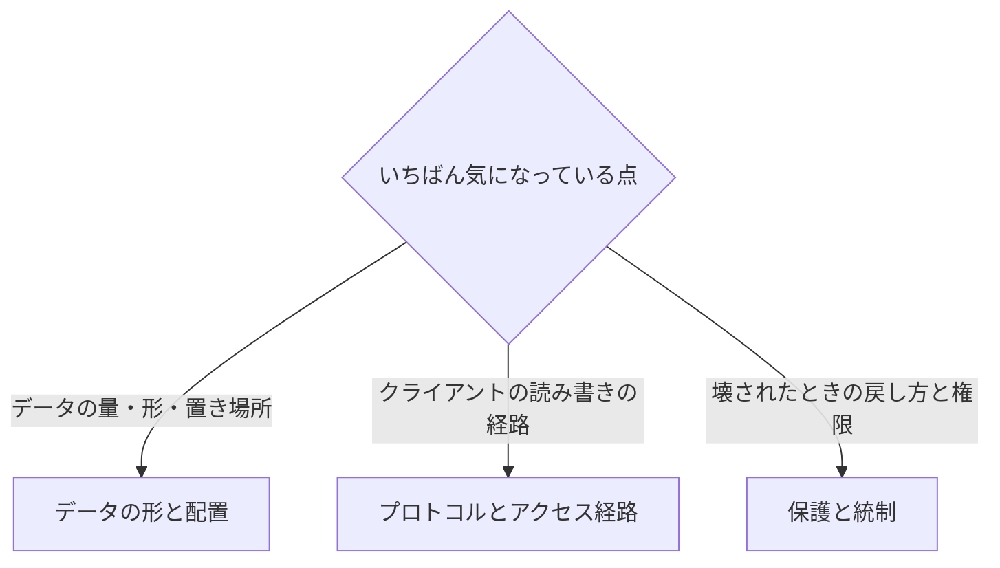

# ワークロード別の入口マップ

[🏠 リポジトリトップ](../../../README.md) | [Reference](README.md)

---

## 結論

**このマップは、走らせているワークロードの形から、最初に読むノートの節を引くための索引です。** playbooks や domains のモジュール名を知らなくても、手元のワークロードに近い行から入れます。

**入り方は、いちばん気になっている点で 3 つに分かれます。**

- **データの量・形・置き場所が気になるなら** → [データの形と配置](#データの形と配置)。小さなファイルが大量にある NAS、大量の並列書き込み、多数のクライアントや拠点からの読み取り、冷えたデータの容量コスト
- **クライアントがどの経路で読み書きするかが気になるなら** → [プロトコルとアクセス経路](#プロトコルとアクセス経路)。SMB、NFS、S3 Access Points
- **壊されたときの戻し方と、誰が何をできるかが気になるなら** → [保護と統制](#保護と統制)。SnapMirror の宛先の使い方、ランサムウェア対策、管理面の統制と監査

**このページは知見を持ちません。** 各行はノートの節へのリンクで、数値・上限・版はリンク先にだけあります。ここに写すと、ノート側だけが直されたときに古い値が残るためです。

> **区分**: `documented` — 各リンク先のノートと節の所在を記載しています。リンク先の知見の多くは ONTAP 一般の `documented` で、Amazon FSx for NetApp ONTAP での挙動は各ノートが「未確認」の範囲として切り分けています。**チューニングや設計判断に使う前に、そのノートの未確認の範囲を読んでください。** このマップに行があることは、その挙動が FSx for ONTAP で確認済みであることを意味しません。

---

## ワークロード別の入口

各行の区分はリンク先のノートの区分です。「防ぐ問題」は、そのノートを読まずに進めたときに起きやすい失敗を言葉で書いたもので、値はリンク先にあります。

### データの形と配置

| ワークロード | 最初に読む（節リンク） | 次に読む | 防ぐ問題 |
|---|---|---|---|
| 小さなファイルが大量にある NAS（ホームディレクトリ、ソースツリー、EDA の作業領域など） | [容量が余っていても書けなくなる — 使い切ったときの挙動](../playbooks/01-assess/notes/counting-bytes-is-not-counting-files.md#使い切ったときの挙動) / [詰まり始める平均ファイルサイズ](../playbooks/01-assess/notes/counting-bytes-is-not-counting-files.md#詰まり始める平均ファイルサイズ) | [ディレクトリ単位の上限 — 上限に達したときの挙動](../domains/performance/notes/directory-size-is-capped-separately-from-file-count.md#上限に達したときの挙動) / [FSx for ONTAP 側の記載と未確認の範囲](../domains/performance/notes/directory-size-is-capped-separately-from-file-count.md#fsx-for-ontap-側の記載と未確認の範囲) / [高ファイル数への適合 — 判断の前に揃える見積もり](../playbooks/01-assess/notes/file-count-fit-depends-on-namespace-shape.md#判断の前に揃える-4-つの見積もり) | 容量が余っているのに新しいファイルを作れなくなる。ボリューム全体より先に、特定のディレクトリだけが詰まる |
| 大量の並列書き込み（ingest） | [FlexGroup — 作成時に決まる ingest の分散](../domains/performance/notes/flexgroup-balances-at-file-creation-not-afterward.md#作成時に決まる-ingest-の分散) / [FlexVol からの変換で再配置されないデータ](../domains/performance/notes/flexgroup-balances-at-file-creation-not-afterward.md#flexvol-からの変換で再配置されないデータ) | [FSx for ONTAP 側の記載と未確認の範囲](../domains/performance/notes/flexgroup-balances-at-file-creation-not-afterward.md#fsx-for-ontap-側の記載と未確認の範囲) | 後から構成を変えても既存データの偏りが残り、一部のメンバーだけが先に埋まる |
| 多数のクライアントや拠点からの読み取り（Origin と FlexCache） | [FlexCache が効く条件](../domains/data-utilization/notes/reaching-data-without-copies.md#flexcache-が効く条件) / [FlexCache の無効化と整合](../domains/data-utilization/notes/reaching-data-without-copies.md#flexcache-の無効化と整合) | [属性キャッシュの扱いと未確認の範囲](../domains/data-utilization/notes/reaching-data-without-copies.md#属性キャッシュの扱いと未確認の範囲) | 効かない読み方のデータにキャッシュを置く。キャッシュが古い内容を返さない仕組みを、時間で期限切れにする方式だと取り違える |
| 冷えたデータの容量コスト（階層化） | [判断の分かれ目 — 読んだときに戻るか](comparison/tiering-policies.md#判断の分かれ目--読んだときに戻るか) / [AUTO が向かないワークロードの条件](comparison/tiering-policies.md#auto-が向かないワークロードの条件) | [cooling period と読み戻しの挙動](comparison/tiering-policies.md#cooling-period-と読み戻しの挙動) / [SnapMirror の宛先での階層化](comparison/tiering-policies.md#snapmirror-の宛先での階層化) | 定期的な全件読み取りでデータが冷えず、見込んだ容量削減が起きない。複製先の書き込み先を送り元と同じだと思い込む |

### プロトコルとアクセス経路

| ワークロード | 最初に読む（節リンク） | 次に読む | 防ぐ問題 |
|---|---|---|---|
| SMB のファイルサーバー、SMB 上の SQL Server | [SMB 署名と sealing の既定値と性能への影響](../domains/security-governance/notes/what-the-platform-gives-and-what-stays-yours.md#smb-署名と-sealing-の既定値と性能への影響) / [SMB 暗号化の強制による、クライアント接続の不可](../domains/security-governance/notes/what-the-platform-gives-and-what-stays-yours.md#smb-暗号化の強制によるクライアント接続の不可) | [SMB の最小版の扱い](../domains/security-governance/notes/what-the-platform-gives-and-what-stays-yours.md#smb-10-の無効化と最小版の扱い) / [Multichannel・CA 共有・oplock の ONTAP 一般の前提](comparison/file-storage-options.md#multichannelca-共有oplock-の-ontap-一般の前提) | 暗号化の強制で一部のクライアントが接続できなくなる。署名や暗号化による性能差を、容量や性能の不足と取り違える。ONTAP 一般の前提を FSx for ONTAP で確認済みと見なす |
| NFS で使う Linux のワークロード | [NFSv4.x の版と機能差](file-protocol-resource-map.md#nfsv4x-の版と機能差) / [転送中の暗号化](file-protocol-resource-map.md#転送中の暗号化) | [NFS over TLS の位置づけと FSx for ONTAP での未確認の範囲](../domains/security-governance/notes/what-the-platform-gives-and-what-stays-yours.md#nfs-over-tls-の位置づけと-fsx-for-ontap-での未確認の範囲) | マウントする版で使える機能が違うことに後から気づく。NFS over TLS を FSx for ONTAP で使える前提で設計する |
| S3 API でファイルを読み書きする（S3 Access Points） | [TR の上限値と挙動が S3 Access Points に当てはまらないこと](../domains/data-utilization/notes/s3-access-point-constraints.md#tr-4814-の上限値と挙動が-s3-access-points-に当てはまらないこと) | [FSx for ONTAP S3 Access Points は S3 として使えるか](../domains/data-utilization/notes/s3-access-point-constraints.md) / [クライアント到達経路の決定木](decision-trees/client-access-route.md) | ONTAP の S3 の資料にある値や挙動を S3 Access Points にそのまま当てはめる。S3 バケットと同じ操作ができる前提で設計する |

### 保護と統制

| ワークロード | 最初に読む（節リンク） | 次に読む | 防ぐ問題 |
|---|---|---|---|
| DR の宛先での分析や検証（SnapMirror の宛先を読む） | [SnapMirror のポリシー種別と保持・ラグ・扇形展開の上限](comparison/data-protection-methods.md#snapmirror-のポリシー種別と保持ラグ扇形展開の上限) / [break なしで読める稼働中の宛先](comparison/data-protection-methods.md#break-なしで読める稼働中の宛先) | [リストアテスト](comparison/data-protection-methods.md#リストアテスト) | 宛先を読むためだけに関係を break し、以後の転送を止める。ポリシー種別の選び違いで保持やラグの見込みが外れる。戻せることを確かめないまま DR があると見なす |
| ランサムウェア対策、規制対応 | [ARP の世代と学習期間の、版とボリューム種別による違い](../domains/data-protection/notes/snaplock-and-layered-ransomware-readiness.md#arp-の世代と学習期間の版とボリューム種別による違い) / [派生機能 Snapshot locking の非 SnapLock ボリュームへの適用](../domains/data-protection/notes/snaplock-and-layered-ransomware-readiness.md#派生機能-snapshot-locking-の非-snaplock-ボリュームへの適用) / [論理エアギャップ（cyber vault）という不変性層の置き方](../domains/data-protection/notes/snaplock-and-layered-ransomware-readiness.md#論理エアギャップcyber-vaultという不変性層の置き方) | [不可逆な操作の承認ゲート](../domains/security-governance/notes/irreversible-operations-need-separate-approval.md#承認ゲート) / [「SnapLock を使っていない」の、保護としての不成立](../domains/security-governance/notes/irreversible-operations-need-separate-approval.md#snaplock-を使っていないの保護としての不成立) | 学習期間の有無を版とボリューム種別で確かめずに保護の開始時期を見込む。SnapLock を使っていないから戻せない操作は無いと思い込み、ロックで削除できなくなる |
| 管理面の統制と監査 | [管理面を守る制御の分解](../domains/security-governance/notes/admin-plane-protection-depends-on-several-controls.md#管理面を守る制御の分解) / [選び方 — 着手する制御の順序](../domains/security-governance/notes/admin-plane-protection-depends-on-several-controls.md#選び方--着手する制御の順序) | [S3 Access Point 経由の書き込みが監査ログに残す識別情報](../domains/data-utilization/notes/fpolicy-fits-by-how-writes-land.md#s3-access-point-経由の書き込みが監査ログに残す識別情報) / [ウイルス対策でベンダーより前に決まる条件](../domains/security-governance/notes/vscan-scope-is-bounded-before-the-vendor.md#ベンダーより前に決まる-4-つの条件) / [書き込みの着地経路による、インラインでの拒否の可否](../domains/security-governance/notes/vscan-scope-is-bounded-before-the-vendor.md#書き込みの着地経路によるインラインでの拒否の可否) | 1 つの制御で管理面が守られていると見なす。S3 Access Points 経由の書き込みでも、監査ログから誰が書いたかを辿れると思い込む。ウイルス対策の製品を選んでから、着地の瞬間に止められない書き込み経路に気づく |

---

## 選択フロー

いちばん気になっている点から、読む節を選びます。図と同じ内容を下の表にも書いています。

| いちばん気になっている点 | 読む節 |
|---|---|
| データの量・形・置き場所 | [データの形と配置](#データの形と配置) |
| クライアントの読み書きの経路 | [プロトコルとアクセス経路](#プロトコルとアクセス経路) |
| 壊されたときの戻し方と権限 | [保護と統制](#保護と統制) |

気になる点が複数あるときは、当てはまる節をすべて読んでください。行どうしに優先順位は付けていません。

---

## よくある誤解

| 誤解 | 実際 |
|---|---|
| このマップに載っていることは検証済み | このマップは何も検証していません。各行の区分はリンク先のノートの区分で、多くは ONTAP 一般の記載です。FSx for ONTAP での挙動は各ノートの未確認の範囲を読んでください |
| 自分のワークロードが表に無いので読む行が無い | 形が近い行を読んでください。行を決めているのは業種や製品名ではなく、ファイルの数と大きさ、読み書きの経路、保護の要件です |
| 業種別リソースマップと同じもの | [業種別リソースマップ](industry-resource-map.md)は業種から公開事例と実装パターンを引くページで、このマップはワークロードの形からノートの節を引くページです |

---

## 関連ドキュメント

| ドキュメント | 関係 |
|---|---|
| [業種別リソースマップ](industry-resource-map.md) | 業種から入るときの読む順序と、公開事例・実装パターンの索引 |
| [モダナイゼーション旅程マップ](modernization-journey-map.md) | 移行の後に何をどの順で読むか |
| [ナビゲーションガイド](../navigation.md) | 状況や役割から入る導線 |
| [知見の分類ポリシー](../evidence-policy.md) | `documented` と `verified` などの区分の意味 |
| [本番投入前レビュー](../playbooks/04-build/checklists/pre-production-review.md) | 後から変えられない項目の確認 |

---
[🏠 リポジトリトップ](../../../README.md) | [Reference](README.md)
<!-- lang-switcher:start -->
🌐 [日本語](workload-entry-map.md) | [English](../../en/reference/workload-entry-map.md) | [🏠 リポジトリトップ](../../../README.md)
<!-- lang-switcher:end -->
