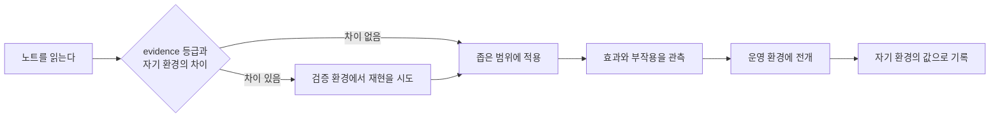
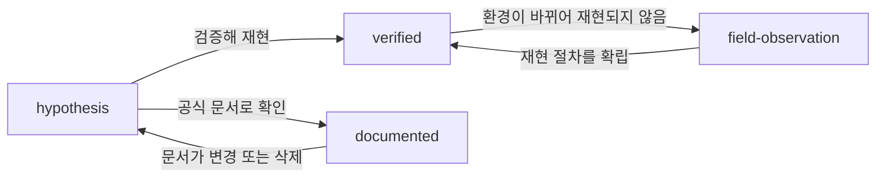

# 근거 분류 정책

<!-- lang-switcher:start -->
🌐 [日本語](../ja/evidence-policy.md) | [English](../en/evidence-policy.md) | [한국어](evidence-policy.md) | [简体中文](../zh-CN/evidence-policy.md) | [繁體中文](../zh-TW/evidence-policy.md) | [Français](../fr/evidence-policy.md) | [Deutsch](../de/evidence-policy.md) | [Español](../es/evidence-policy.md) | [🏠 저장소 홈](README.md)
<!-- lang-switcher:end -->

---

## 결론

이 리포지토리의 모든 지식은 `evidence`라는 4단계 등급을 가집니다. 독자는 이 등급을 보고 **그 기술을 어디까지 신뢰하여 자신의 환경에 적용할 수 있는지**를 판단하십시오. 등급은 frontmatter에 기계 판독 가능한 형태로 들어 있으며, `make lint`가 등급별 필수 메타데이터를 검사합니다.

등급을 올리려면(신뢰도가 높은 쪽으로 이동) 해당하는 근거를 추가해야 합니다. 내리는 것은 언제나 자유입니다.

---

## 네 가지 등급

| 등급 | 의미 | 필수 메타데이터 | 독자 측의 취급 |
|---|---|---|---|
| `verified` | 기재된 환경에서 저자가 실제로 재현했다 | `verified_on`(검증일) + 본문에 검증 환경 | 그 환경 조건에서는 신뢰할 수 있다. 조건이 다르면 재검증이 필요하다 |
| `documented` | 벤더 또는 AWS 공식 문서에 기재가 있다 | `source`(URL 또는 문서명) | 1차 정보로 취급할 수 있다. 다만 버전·리전 차이에 주의 |
| `field-observation` | 현장에서 한 번 관측했으나 재현 확인을 하지 않았다 | 본문에 "재현 미확인"을 명기 | 가설의 단서. 일반화해서는 안 된다 |
| `hypothesis` | 논리적으로 도출한 추론이며 미검증 | 본문에 "미검증"을 명기 | 검증의 출발점. 판단의 근거로 삼을 수 없다 |

---

## 등급이 답하지 않는 것

등급은 **그 기술의 출처**를 분류합니다. **추적의 정도나 확실성의 척도가 아닙니다.** 다른 어휘를 쓰는 저장소와 상호 링크할 때 이 경계에서 의미가 어긋납니다.

### `documented` 는 실측을 함의하지 않습니다

`documented` 가 뜻하는 것은 "벤더 또는 AWS 문서에 기재가 있다"는 것뿐입니다. **저자가 그 동작을 직접 확인했다는 주장은 포함하지 않습니다.** 실측을 주장하는 등급은 `verified` 뿐입니다.

따라서 "일차 자료에는 기재가 있으나 실제 장비에서는 확인하지 않았다"는 `documented` 입니다. **이 대응에서 정보는 손실되지 않습니다.** 다른 저장소가 같은 상태를 `unverified` 같은 말로 부르더라도 그대로 `documented` 로 옮길 수 있습니다.

### 문서의 부재는 등급이 아닙니다

"찾아보았으나 공개 자료에서 기재를 찾지 못했다"는 **제품의 동작에 대한 주장이 아니라 자료의 상태에 대한 주장입니다.** 네 등급은 모두 기술의 근거를 분류하며, 근거의 부재를 나타내지 않습니다.

특히 `hypothesis` 를 쓰지 마십시오. `hypothesis` 는 **논리적으로 도출한 추론이 있다**는 뜻입니다. 추론 없이 쓰면 갖고 있지 않은 근거를 가진 것처럼 보입니다.

쓸 곳은 본문입니다. **탐색 날짜와 탐색 범위를 명시하십시오.** "2026-08 시점에는 AWS 공식 문서에서 기재를 찾지 못했다"처럼 언제 어디를 찾았는지 알 수 있는 형태로 씁니다. 상한값이나 쿼터라면 [상한값·쿼터](../ja/reference/limits/) (日本語) 의 "Could not be measured" 절이 놓을 자리입니다. (해당 문서의 제목은 일본어와 영어로 표기되어 있습니다.)

---

## 왜 이 등급이 필요한가

기술 지원 현장에서 얻는 정보는 성질이 크게 다릅니다.

- 공식 문서에 적혀 있는 것
- 검증 환경에서 재현한 실측값
- 한 번만 관측되었으나 원인을 특정하지 못한 동작
- "아마 이럴 것이다"라는 추론

이것들을 같은 문체로 나열하면 독자는 구별할 수 없습니다. 특히 **한 번만 관측한 동작**을 일반적인 사양처럼 쓰면 독자가 잘못된 전제로 설계하게 됩니다. 등급을 명시함으로써 기술의 강도와 근거의 강도를 일치시킵니다.

---

## 수치를 쓸 때의 필수 조건

`verified`의 수치에는 반드시 측정 조건을 함께 기재합니다. 조건이 없는 수치는 재현할 수 없고, 재현할 수 없는 수치는 판단에 쓸 수 없습니다.

| 함께 기재할 항목 | 예 |
|---|---|
| ONTAP 버전 | `9.17.1P7D1` |
| 리전 | `ap-northeast-1` |
| 구성 | 처리량 설정, 볼륨 종류, 클라이언트 종류 |
| 측정 방법 | 도구, 병렬도, 파일 크기, 실행 횟수 |
| 측정일 | `2026-08-06` |

그리고 다음 구분을 반드시 명시합니다.

| 구별해야 할 것 | 혼동했을 때 일어나는 일 |
|---|---|
| 샘플 실행 vs 운영 환경 견적 | 단발 측정값이 용량 계획의 근거로 쓰인다 |
| 이 검증 환경 vs 일반적인 서비스 상한 | 환경 고유의 값이 서비스 사양으로 인용된다 |
| 설계상의 고려 사항 vs 법무·컴플라이언스 판단 | 가이던스가 법적 근거로 취급된다 |
| AI의 보조적 시사 vs 최종 판단 | 자동 판정 결과가 사람의 확인 없이 확정된다 |

---

## 운영 환경에 도입하기 전 확인

등급은 "어디까지 신뢰할 수 있는가"를 나타낼 뿐이며 **당신의 환경에서 성립한다는 것을 보증하지 않습니다.** 운영 환경에 넣기 전에 등급별로 다음을 확인하십시오.

| 등급 | 운영 전에 반드시 할 일 |
|---|---|
| `verified` | 기재된 검증 환경과 자기 환경의 차이를 찾아낸다. 버전·리전·구성 중 하나라도 다르면 다시 측정한다 |
| `documented` | 출처를 실제로 열어 현행판에도 같은 기술이 있는지 확인한다. 문서는 개정된다 |
| `field-observation` | 자기 환경에서 재현되는지 확인한다. 재현되지 않으면 그 기술은 전제로 쓸 수 없다 |
| `hypothesis` | 검증한 뒤에 쓴다. 미검증 추론을 설계의 근거로 삼지 않는다 |

### 적용 절차



| # | 절차 | 목적 |
|---|---|---|
| 1 | `evidence` 등급과 기재된 환경 조건을 확인한다 | 어디까지가 검증되었는지 파악한다 |
| 2 | 자기 환경과의 차이(버전 / 리전 / 구성 / 부하)를 적어 낸다 | 재검증이 필요한 범위를 확정한다 |
| 3 | 운영과 같은 구성의 검증 환경에서 재현한다 | 운영 환경에서 처음 동작을 알게 되는 상황을 피한다 |
| 4 | 영향 범위를 한정해 적용하고 관측한다 | 예상 밖의 부작용을 작은 단위로 잡는다 |
| 5 | 자기 환경에서의 결과를 기록한다 | 다음 판단의 재료로 삼는다. 차이가 있으면 [Issue](https://github.com/Yoshiki0705/FSx-for-ONTAP-Adoption-Playbook/issues)로 공유를 환영합니다 |

**되돌릴 수 없는 조작은 절차 3을 생략할 수 없습니다.** SnapLock 활성화처럼 되돌릴 수 없는 설정은 검증 환경에서의 확인을 거치지 않고 운영 환경에 넣지 마십시오.

---

## 등급의 승급·강등



| 전이 | 필요한 작업 |
|---|---|
| → `verified` | 검증 환경을 명기하고 `verified_on`을 추가. 재현 절차를 본문에 기재 |
| → `documented` | `source`에 URL을 추가. 축어 인용은 30단어 이내, 원칙은 요약 |
| `verified` → `field-observation` | 재현되지 않게 된 경위를 본문에 추가. 값은 지우지 않고 이력으로 남긴다 |
| → `hypothesis` | 근거가 사라진 이유를 명기 |

**강등은 품질 저하가 아닙니다.** 근거가 사라졌음을 정직하게 밝히는 것이 오래된 `verified`를 방치하는 것보다 독자에게 안전합니다.

---

## 흔한 오해

| 오해 | 실제 |
|---|---|
| `documented`가 가장 신뢰할 수 있다 | 문서와 구현이 어긋나는 경우가 있습니다. `verified`는 자기 환경에서의 사실입니다 |
| `verified`라면 운영 환경에서도 같은 결과가 나온다 | 검증 환경에서의 실측입니다. 운영의 구성·부하가 다르면 결과는 달라집니다 |
| `field-observation`은 싣지 않아야 한다 | 실을 가치가 있습니다. 다만 일반화하지 않고 재현 미확인임을 명시합니다 |
| 등급을 올리지 않으면 가치가 없다 | `hypothesis`로서 검증의 출발점을 공유하는 것에도 가치가 있습니다 |

---

## frontmatter 작성 방법

```yaml
---
title: SnapMirror の初期同期でスループットが出ない場合の切り分け
lifecycle: [migrate]
domains: [performance]
evidence: verified
verified_on: 2026-08-06
ontap_version: 9.17.1P7D1
region: ap-northeast-1
lang: ja
---
```

`make lint`가 검사하는 내용:

- `evidence: verified`일 때 `verified_on`이 있고 미래 날짜가 아닐 것
- `evidence: documented`일 때 `source`가 있을 것
- `evidence: field-observation`일 때 본문에 "재현 미확인"에 상당하는 기술이 있을 것
- `evidence: hypothesis`일 때 본문에 "미검증"에 상당하는 기술이 있을 것
- `lifecycle` / `domains`의 값이 정의된 어휘에 포함될 것

---

## 관련 문서

- [내비게이션 가이드](navigation.md)
- [CONTRIBUTING.md](../../CONTRIBUTING.md)
- [AGENTS.md](../../AGENTS.md) — AI 에이전트용 규약
- [리포지토리 홈](README.md)

---

<!-- lang-switcher:start -->
🌐 [日本語](../ja/evidence-policy.md) | [English](../en/evidence-policy.md) | [한국어](evidence-policy.md) | [简体中文](../zh-CN/evidence-policy.md) | [繁體中文](../zh-TW/evidence-policy.md) | [Français](../fr/evidence-policy.md) | [Deutsch](../de/evidence-policy.md) | [Español](../es/evidence-policy.md) | [🏠 저장소 홈](README.md)
<!-- lang-switcher:end -->
