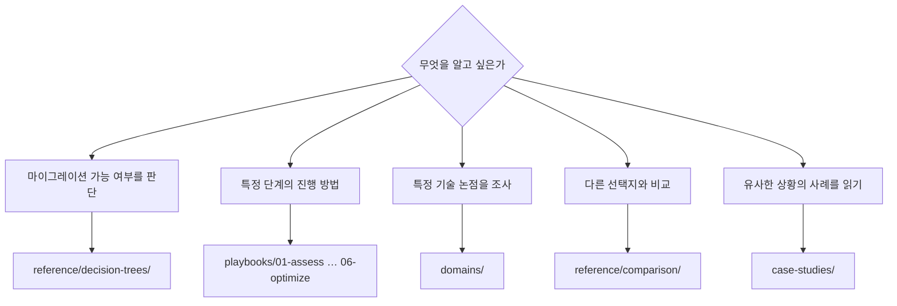

# 내비게이션 가이드

<!-- lang-switcher:start -->
🌐 [日本語](../ja/navigation.md) | [English](../en/navigation.md) | [한국어](navigation.md) | [简体中文](../zh-CN/navigation.md) | [繁體中文](../zh-TW/navigation.md) | [Français](../fr/navigation.md) | [Deutsch](../de/navigation.md) | [Español](../es/navigation.md) | [🏠 저장소 홈](README.md)
<!-- lang-switcher:end -->

---

## 결론

입구는 세 가지입니다. **처음 방문하셨다면 [자신의 환경에서 찾기](#자신의-환경에서-찾기)부터 시작하십시오.** 구성의 특징을 고르면 읽는 순서가 정해집니다.

프로젝트 진행에 따라 찾으려면 `playbooks/`, 논점에서 찾으려면 `domains/`입니다. 어느 쪽으로 들어가도 같은 노트에 도달합니다. 선택지가 여러 개여서 결정하기 어려운 경우에는 `reference/decision-trees/`부터 시작하십시오.

---

## 어디서부터 읽을까

---

## 자신의 환경에서 찾기

위의 분기는 "무엇을 알고 싶은가"에서 시작합니다. **"내 구성이라면 어디를 읽어야 하는가"**로 찾으려면 이 표를 사용하십시오. 왼쪽이 자기 환경의 특징, 오른쪽이 읽는 순서입니다.

| 자기 환경의 특징 | 먼저 읽기 | 다음에 읽기 |
|---|---|---|
| 마이그레이션 원본이 ONTAP (온프레미스 / 다른 클라우드) | [마이그레이션 방식 결정 트리](../ja/reference/decision-trees/migration-method.md) (日本語) | [평가](../en/playbooks/01-assess/) → [설계](../en/playbooks/02-design/) (English) |
| 마이그레이션 원본이 Windows 파일 서버 (SMB / NTFS ACL 보존이 요건) | [마이그레이션 방식 결정 트리](../ja/reference/decision-trees/migration-method.md) (日本語) | [멀티프로토콜·ID](../en/domains/multiprotocol-identity/) (English) |
| 마이그레이션 원본이 ONTAP 이외의 NAS | [마이그레이션 방식 결정 트리](../ja/reference/decision-trees/migration-method.md) (日本語) | [평가](../en/playbooks/01-assess/) (English) |
| NFS와 SMB를 같은 데이터에 사용 | [보안 스타일이 권한 평가 모델을 결정한다](../ja/domains/multiprotocol-identity/notes/security-style-and-permission-evaluation.md) (日本語) | [보안·거버넌스](../en/domains/security-governance/) (English) |
| Active Directory 연동이 전제 | [멀티프로토콜·ID](../en/domains/multiprotocol-identity/) (English) | [설계](../en/playbooks/02-design/) (English) |
| 신규 구축 (마이그레이션 원본 없음) | [설계](../en/playbooks/02-design/) (English) | [구축](../en/playbooks/04-build/) → [운영](../en/playbooks/05-operate/) (English) |
| 이미 운영 중이며 성능을 개선하고 싶다 | [성능](../en/domains/performance/) (English) | [최적화](../en/playbooks/06-optimize/) (English) |
| 이미 운영 중이며 비용을 재검토하고 싶다 | [비용](../en/domains/cost/) (English) | [최적화](../en/playbooks/06-optimize/) (English) |
| 상한값에 걸리지 않는지 확인하고 싶다 | [상한값·쿼터](../ja/reference/limits/) | [설계](../en/playbooks/02-design/) (English) |

위 링크에 대해 알아 두실 두 가지입니다.

| 표시 | 예상할 내용 |
|---|---|
| **(日本語)** / **(English)** | 한국어판이 없습니다. 심층 자료는 일본어와 영어에만 존재합니다. URL, 명령, 제품 용어는 언어에 의존하지 않습니다 |
| `reference/` 링크, 표시 없음 | 일본어와 영어를 한 파일에 병기하고 있어 그대로 읽을 수 있습니다 |

번역 요청은 [Issue](https://github.com/Yoshiki0705/FSx-for-ONTAP-Adoption-Playbook/issues)로 환영합니다.

**어느 행이든 읽은 내용을 그대로 운영 환경에 적용하지 마십시오.** 각 노트의 `evidence` 등급을 확인하고 [운영 환경에 도입하기 전 확인](evidence-policy.md#운영-환경에-도입하기-전-확인) 절차를 거치십시오.

---

## 라이프사이클 축 — `playbooks/`

프로젝트 진행에 따른 입구입니다. 이전 단계의 산출물이 다음 단계의 입력이 됩니다. 링크는 영어판으로 이동합니다.

| # | 모듈 | 주요 산출물 | 다음에 읽기 |
|---|---|---|---|
| 01 | [평가](../en/playbooks/01-assess/) | 현행 인벤토리, 제약 목록 | 02 설계 |
| 02 | [설계](../en/playbooks/02-design/) | 구성 결정, 되돌릴 수 없는 항목 확정 | 03 마이그레이션 |
| 03 | [마이그레이션](../en/playbooks/03-migrate/) | 마이그레이션 계획, 전환 절차, 롤백 절차 | 04 구축 |
| 04 | [구축](../en/playbooks/04-build/) | IaC, 자동화, 구축 후 검증 | 05 운영 |
| 05 | [운영](../en/playbooks/05-operate/) | 모니터링 설계, Runbook | 06 최적화 |
| 06 | [최적화](../en/playbooks/06-optimize/) | 성능·비용 개선 결과 | — |

---

## 주제 축 — `domains/`

논점에서 찾는 입구입니다. 라이프사이클 전반에서 참조됩니다. 링크는 영어판으로 이동합니다.

| 모듈 | 대표적인 질문 |
|---|---|
| [데이터 보호](../en/domains/data-protection/) | Snapshot을 어떻게 설계할까 / 실제로 복구할 수 있을까 |
| [데이터 활용](../en/domains/data-utilization/) | 복사본을 늘리지 않고 분석·AI에 사용할 수 있을까 |
| [보안·거버넌스](../en/domains/security-governance/) | 암호화·감사·권한을 어떻게 설계할까 |
| [성능](../en/domains/performance/) | 처리량은 어디서 결정되고 어디서 공유되는가 |
| [비용](../en/domains/cost/) | 견적과 실측이 왜 어긋나는가 |
| [멀티프로토콜·ID](../en/domains/multiprotocol-identity/) | NFS와 SMB에서 권한이 왜 어긋나는가 |

---

## 횡단 참조 — `reference/`

일본어와 영어를 한 파일에 병기하고 있습니다.

| 디렉터리 | 사용하는 상황 |
|---|---|
| [결정 트리](../ja/reference/decision-trees/) | 선택지가 여러 개이며 무엇을 고를지 정하고 싶다 |
| [비교 매트릭스](../ja/reference/comparison/) | 다른 선택지와의 트레이드오프를 정리하고 싶다 |
| [상한값·쿼터](../ja/reference/limits/) | 설계가 상한에 걸리지 않는지 확인하고 싶다 |
| [용어집](../ja/reference/glossary/) | ONTAP / AWS 용어의 정의를 확인하고 싶다 |

---

## 사례 — `case-studies/`

[Case Studies](../en/case-studies/)에는 기술 지원 현장에서 얻은 지식을 **일반화된 교훈**으로 실었습니다. 기업명·조직명·실제 식별자·조직을 특정할 수 있는 구성은 일절 포함하지 않습니다.

사례는 다음 형식으로 작성됩니다.

| 섹션 | 내용 |
|---|---|
| 상황 | 업종과 규모대만 (예: 제조업 / 수백 TB 규모) |
| 과제 | 무엇이 문제였는가 |
| 검토한 선택지 | 채택하지 않은 안과 그 이유 |
| 판단 | 무엇을 선택했고 왜 그렇게 판단했는가 |
| 결과 | 무엇이 일어났는가 (예상과 달랐던 점도 포함) |
| 일반화할 수 있는 교훈 | 다른 환경으로 가져갈 수 있는 부분 |

---

## 지식의 신뢰도를 읽는 방법

각 노트의 frontmatter에 `evidence` 등급이 있습니다. **이를 확인하지 않고 인용하지 마십시오.**

| 등급 | 한마디로 |
|---|---|
| `verified` | 기재된 환경에서 저자가 재현 완료 |
| `documented` | 공식 문서에 기재되어 있음 |
| `field-observation` | 한 번 관측, 재현 미확인. 일반화 불가 |
| `hypothesis` | 미검증 추론 |

자세한 내용은 [근거 분류 정책](evidence-policy.md)을 참조하십시오.

---

## 흔한 오해

| 오해 | 실제 |
|---|---|
| `playbooks/`와 `domains/`는 서로 다른 정보를 가진다 | 같은 노트를 두 축에서 참조합니다. 중복이 아니라 복수의 이동 경로입니다 |
| 수치는 그대로 자기 환경에 사용할 수 있다 | 수치는 측정 환경과 한 쌍입니다. 조건이 다르면 재검증이 필요합니다 |
| 사례에는 구체적인 구성이 실려 있다 | 의도적으로 추상화했습니다. 조직을 특정할 수 있는 정보는 싣지 않습니다 |
| 상한값은 항상 최신이다 | `reference/limits/`는 검증일이 함께 기재됩니다. 날짜가 오래된 항목은 재확인하십시오 |

---

## 관련 문서

- [근거 분류 정책](evidence-policy.md)
- [CONTRIBUTING.md](../../CONTRIBUTING.md) — 집필 규약
- [AGENTS.md](../../AGENTS.md) — AI 에이전트용 규약
- [llms.txt](../../llms.txt) — LLM용 리포지토리 맵

---

<!-- lang-switcher:start -->
🌐 [日本語](../ja/navigation.md) | [English](../en/navigation.md) | [한국어](navigation.md) | [简体中文](../zh-CN/navigation.md) | [繁體中文](../zh-TW/navigation.md) | [Français](../fr/navigation.md) | [Deutsch](../de/navigation.md) | [Español](../es/navigation.md) | [🏠 저장소 홈](README.md)
<!-- lang-switcher:end -->
