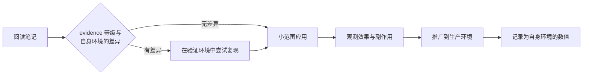
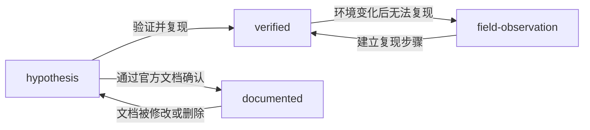

# 知识分类政策

<!-- lang-switcher:start -->
🌐 [日本語](../ja/evidence-policy.md) | [English](../en/evidence-policy.md) | [한국어](../ko/evidence-policy.md) | [简体中文](evidence-policy.md) | [繁體中文](../zh-TW/evidence-policy.md) | [Français](../fr/evidence-policy.md) | [Deutsch](../de/evidence-policy.md) | [Español](../es/evidence-policy.md) | [🏠 仓库首页](README.md)
<!-- lang-switcher:end -->

---

## 结论

本仓库中的所有知识都带有名为 `evidence` 的四级等级。读者应依据该等级判断**该项描述可以在多大程度上被信任并应用于自己的环境**。等级以机器可读的形式写入 frontmatter，`make lint` 会检查各等级的必填元数据。

要提升等级（向可信度更高的一侧移动），必须补充相应的证据。降级则始终自由。

---

## 四个等级

| 等级 | 含义 | 必填元数据 | 读者应如何对待 |
|---|---|---|---|
| `verified` | 作者在所述环境中实际复现过 | `verified_on`（验证日期）+ 正文中的验证环境 | 在该环境条件下可以信任。条件不同则需重新验证 |
| `documented` | 厂商或 AWS 官方文档中有记载 | `source`（URL 或文档名） | 可作为一次信息对待。但需注意版本与区域差异 |
| `field-observation` | 在现场观测过一次，但未做复现确认 | 正文中明记"未确认可复现" | 假设的线索。不得一般化 |
| `hypothesis` | 逻辑推导得出的推断，未经验证 | 正文中明记"未验证" | 验证的起点。不能作为判断依据 |

---

## 等级没有回答的问题

等级划分的是**该表述的来源**。**它不是追查程度，也不是确信度量表。** 与使用不同词汇的仓库互相链接时，含义正是在这条边界上发生偏移。

### `documented` 并不含有实测之意

`documented` 仅表示"厂商或 AWS 文档中有记载"。**它不包含作者亲自确认过该行为的主张。** 主张实测的等级只有 `verified`。

因此"一次资料中有记载，但未在实机上追查"属于 `documented`。**这一对应不会丢失信息**，正因为 `documented` 本来就不含实测之意。若其他仓库把同一状态称作 `unverified` 之类，也可原样映射到 `documented`。

### 文档的缺失不是一个等级

"查找过但未能在公开资料中找到记载"是**关于资料状态的主张，而非关于产品行为的主张。** 四个等级都是对表述依据的分类，都不表示依据的缺失。

尤其不要使用 `hypothesis`。`hypothesis` 意味着**存在经过推理得出的预期**。在没有推理时使用它，会让笔记看起来握有并不存在的依据。

应写在正文中。**请注明查找日期与查找范围** —— 例如"截至 2026-08，未在 AWS 官方文档中找到相关记载"—— 让读者能判断你何时、在何处查找过。若属于上限值或配额，可放在[上限值与配额](../ja/reference/limits/) (日本語)的 "Could not be measured" 一节（该文档标题以日文与英文并列）。

---

## 为何需要这一等级划分

技术支持现场获得的信息，性质差异很大。

- 官方文档中写明的内容
- 在验证环境中复现的实测值
- 仅观测过一次但未查明原因的行为
- "大概是这样"的推断

若以相同的语气并列陈述，读者无法区分。尤其是把**仅观测过一次的行为**写成一般规格，会导致读者基于错误前提进行设计。明示等级，可使表述的强度与证据的强度保持一致。

---

## 书写数值时的必要条件

`verified` 的数值必须同时写明测量条件。没有条件的数值无法复现，而无法复现的数值不能用于判断。

| 需一并记录的项目 | 示例 |
|---|---|
| ONTAP 版本 | `9.17.1P7D1` |
| 区域 | `ap-northeast-1` |
| 配置 | 吞吐量设置、卷类型、客户端类型 |
| 测量方法 | 工具、并发度、文件大小、执行次数 |
| 测量日期 | `2026-08-06` |

同时必须明确以下区分。

| 必须区分的内容 | 混淆后会发生什么 |
|---|---|
| 样本运行 vs 生产环境估算 | 单次测量值被当作容量规划的依据 |
| 本验证环境 vs 一般的服务上限 | 环境特有的数值被引用为服务规格 |
| 设计上的考量 vs 法务与合规判断 | 指导性内容被当作法律依据 |
| AI 的辅助性提示 vs 最终判断 | 自动判定结果未经人工确认即被确定 |

---

## 投入生产环境前的确认

等级只表示"可以信任到什么程度"，**并不保证在您的环境中同样成立。** 投入生产环境前，请按等级确认以下事项。

| 等级 | 投入生产前必做 |
|---|---|
| `verified` | 找出所述验证环境与自身环境的差异。版本、区域、配置中任一不同即需重新测量 |
| `documented` | 实际打开出处，确认现行版本是否仍有相同表述。文档会被修订 |
| `field-observation` | 确认在自身环境中是否可复现。若不可复现，该表述不能作为前提 |
| `hypothesis` | 验证后再使用。不要以未验证的推断作为设计依据 |

### 应用步骤



| # | 步骤 | 目的 |
|---|---|---|
| 1 | 确认 `evidence` 等级与所述环境条件 | 掌握已验证的范围 |
| 2 | 写出与自身环境的差异（版本 / 区域 / 配置 / 负载） | 确定需要重新验证的范围 |
| 3 | 在与生产相同配置的验证环境中复现 | 避免在生产环境中才首次了解行为 |
| 4 | 限定影响范围后应用并观测 | 以小单位捕捉预期外的副作用 |
| 5 | 记录自身环境中的结果 | 作为下次判断的依据。若有差异，欢迎通过 [Issue](https://github.com/Yoshiki0705/FSx-for-ONTAP-Adoption-Playbook/issues) 分享 |

**不可逆的操作不能省略步骤 3。** 诸如启用 SnapLock 这类无法回退的设置，请勿在未经验证环境确认的情况下投入生产环境。

---

## 等级的升级与降级



| 迁移 | 所需工作 |
|---|---|
| → `verified` | 明记验证环境并添加 `verified_on`。在正文中记载复现步骤 |
| → `documented` | 在 `source` 中添加 URL。逐字引用不超过 30 个词，原则上应做摘要 |
| `verified` → `field-observation` | 在正文中补充无法复现的经过。数值不删除，作为历史保留 |
| → `hypothesis` | 明记依据丧失的原因 |

**降级并非质量下降。** 诚实地表明证据已经丧失，比放任过时的 `verified` 对读者更安全。

---

## 常见误解

| 误解 | 实际情况 |
|---|---|
| `documented` 最可信 | 文档与实现可能存在偏离。`verified` 是自身环境中的事实 |
| 只要是 `verified`，生产环境也会得到相同结果 | 那是验证环境中的实测。生产的配置与负载不同，结果就会改变 |
| `field-observation` 不应收录 | 有收录价值。但不得一般化，并须明示未确认可复现 |
| 不提升等级就没有价值 | 以 `hypothesis` 形式分享验证的起点也具有价值 |

---

## frontmatter 的写法

```yaml
---
title: SnapMirror の初期同期でスループットが出ない場合の切り分け
lifecycle: [migrate]
domains: [performance]
evidence: verified
verified_on: 2026-08-06
ontap_version: 9.17.1P7D1
region: ap-northeast-1
lang: ja
---
```

`make lint` 检查的内容：

- 为 `evidence: verified` 时存在 `verified_on` 且不是未来日期
- 为 `evidence: documented` 时存在 `source`
- 为 `evidence: field-observation` 时正文中有相当于"未确认可复现"的表述
- 为 `evidence: hypothesis` 时正文中有相当于"未验证"的表述
- `lifecycle` / `domains` 的取值包含在已定义的词汇中

---

## 相关文档

- [导航指南](navigation.md)
- [CONTRIBUTING.md](../../CONTRIBUTING.md)
- [AGENTS.md](../../AGENTS.md) — 面向 AI 代理的规约
- [仓库首页](README.md)

---

<!-- lang-switcher:start -->
🌐 [日本語](../ja/evidence-policy.md) | [English](../en/evidence-policy.md) | [한국어](../ko/evidence-policy.md) | [简体中文](evidence-policy.md) | [繁體中文](../zh-TW/evidence-policy.md) | [Français](../fr/evidence-policy.md) | [Deutsch](../de/evidence-policy.md) | [Español](../es/evidence-policy.md) | [🏠 仓库首页](README.md)
<!-- lang-switcher:end -->
