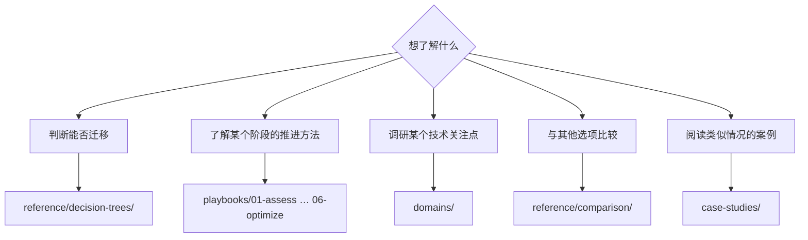

# 导航指南

<!-- lang-switcher:start -->
🌐 [日本語](../ja/navigation.md) | [English](../en/navigation.md) | [한국어](../ko/navigation.md) | [简体中文](navigation.md) | [繁體中文](../zh-TW/navigation.md) | [Français](../fr/navigation.md) | [Deutsch](../de/navigation.md) | [Español](../es/navigation.md) | [🏠 仓库首页](README.md)
<!-- lang-switcher:end -->

---

## 结论

入口有三个。**如果是初次访问，请从[从自己的环境查找](#从自己的环境查找)开始。** 选择配置特征即可确定阅读顺序。

若按项目进展查找，使用 `playbooks/`；若从关注点查找，使用 `domains/`。两条路径都会到达同一批笔记。当存在多个选项而难以决定时，请从 `reference/decision-trees/` 开始。

---

## 从哪里开始读

---

## 从自己的环境查找

上面的分支从"想了解什么"开始。若想按**"以我的配置该读哪里"**查找，请使用此表。左侧是自身环境的特征，右侧是阅读顺序。

| 自身环境的特征 | 先读 | 再读 |
|---|---|---|
| 迁移源是 ONTAP（本地 / 其他云） | [迁移方式决策树](../ja/reference/decision-trees/migration-method.md) (日本語) | [评估](../en/playbooks/01-assess/) → [设计](../en/playbooks/02-design/) (English) |
| 迁移源是 Windows 文件服务器（要求保留 SMB / NTFS ACL） | [迁移方式决策树](../ja/reference/decision-trees/migration-method.md) (日本語) | [多协议与身份](../en/domains/multiprotocol-identity/) (English) |
| 迁移源是非 ONTAP 的 NAS | [迁移方式决策树](../ja/reference/decision-trees/migration-method.md) (日本語) | [评估](../en/playbooks/01-assess/) (English) |
| 对同一份数据同时使用 NFS 和 SMB | [安全样式决定权限评估模型](../ja/domains/multiprotocol-identity/notes/security-style-and-permission-evaluation.md) (日本語) | [安全与治理](../en/domains/security-governance/) (English) |
| 以 Active Directory 集成为前提 | [多协议与身份](../en/domains/multiprotocol-identity/) (English) | [设计](../en/playbooks/02-design/) (English) |
| 想设计 SMB 用户管理与审计 | [SMB 用户管理与审计决策树](../en/reference/decision-trees/smb-identity-and-audit.md) (English) | [多协议与身份](../en/domains/multiprotocol-identity/) (English) |
| SMB 突然无法提供服务 | [无法提供 SMB 的 SVM](../ja/domains/multiprotocol-identity/notes/smb-service-lost-on-cifs-server-delete.md) (日本語) | [SMB 用户管理与审计决策树](../en/reference/decision-trees/smb-identity-and-audit.md) (English) |
| 想启用审计日志 / 想清理本地用户 | [审计目标耗尽会中断访问](../ja/domains/security-governance/notes/audit-log-space-and-client-access.md) (日本語) | [不存在最后登录属性](../ja/domains/multiprotocol-identity/notes/local-user-inventory-without-last-logon.md) (日本語) |
| 全新构建（无迁移源） | [设计](../en/playbooks/02-design/) (English) | [构建](../en/playbooks/04-build/) → [运维](../en/playbooks/05-operate/) (English) |
| 已在运行，希望优化性能 | [性能](../en/domains/performance/) (English) | [优化](../en/playbooks/06-optimize/) (English) |
| 已在运行，希望重新审视成本 | [成本](../en/domains/cost/) (English) | [优化](../en/playbooks/06-optimize/) (English) |
| 想确认设计是否触及上限值 | [上限值与配额](../ja/reference/limits/) | [设计](../en/playbooks/02-design/) (English) |
| 想通过 S3 API 或分析平台访问 | [FSx for ONTAP S3 AP 的前提条件](../ja/domains/data-utilization/notes/s3-access-point-constraints.md) (日本語) | [访问点策略的写法](../en/domains/security-governance/notes/access-point-authorization-layers.md) (English) |

关于上述链接，有两点需要了解。

| 标记 | 应有的预期 |
|---|---|
| **(日本語)** / **(English)** | 尚无中文版。深入的材料仅存在于日语和英语中。URL、命令和产品术语与语言无关 |
| `reference/` 链接，无标记 | 日语和英语并列于同一文件中，可直接阅读 |

欢迎通过 [Issue](https://github.com/Yoshiki0705/FSx-for-ONTAP-Adoption-Playbook/issues) 提出翻译请求。

**无论哪一行，都不要将读到的内容直接应用于生产环境。** 请确认每条笔记的 `evidence` 等级，并走完[投入生产环境前的确认](evidence-policy.md#投入生产环境前的确认)步骤。

---

## 生命周期轴 — `playbooks/`

沿项目进展的入口。上一阶段的产出即下一阶段的输入。链接指向英语版。

| # | 模块 | 主要产出 | 再读 |
|---|---|---|---|
| 01 | [评估](../en/playbooks/01-assess/) | 现状清单、约束列表 | 02 设计 |
| 02 | [设计](../en/playbooks/02-design/) | 配置决策、确定不可逆项 | 03 迁移 |
| 03 | [迁移](../en/playbooks/03-migrate/) | 迁移计划、切换步骤、回滚步骤 | 04 构建 |
| 04 | [构建](../en/playbooks/04-build/) | IaC、自动化、构建后验证 | 05 运维 |
| 05 | [运维](../en/playbooks/05-operate/) | 监控设计、Runbook | 06 优化 |
| 06 | [优化](../en/playbooks/06-optimize/) | 性能与成本的改善结果 | — |

---

## 主题轴 — `domains/`

从关注点查找的入口。贯穿各生命周期阶段被引用。链接指向英语版。

| 模块 | 典型问题 |
|---|---|
| [数据保护](../en/domains/data-protection/) | 如何设计 Snapshot / 是否真的能恢复 |
| [数据利用](../en/domains/data-utilization/) | 能否在不增加副本的前提下用于分析和 AI |
| [安全与治理](../en/domains/security-governance/) | 如何设计加密、审计与权限 |
| [性能](../en/domains/performance/) | 吞吐量在哪里决定、在哪里被共享 |
| [成本](../en/domains/cost/) | 估算与实测为何出现偏差 |
| [多协议与身份](../en/domains/multiprotocol-identity/) | NFS 与 SMB 的权限为何不一致 |
| [块存储](../en/domains/block-storage/) | 以 iSCSI / NVMe-oF 提供 LUN 时，哪些条件已经先被决定 |

---

## 横向参考 — `reference/`

日语与英语并列于同一文件中。

| 目录 | 使用场景 |
|---|---|
| [决策树](../ja/reference/decision-trees/) | 存在多个选项，需要决定选哪一个 |
| [比较矩阵](../ja/reference/comparison/) | 需要梳理与其他选项之间的取舍 |
| [上限值与配额](../ja/reference/limits/) | 需要确认设计不会触及上限 |
| [术语表](../ja/reference/glossary/) | 需要确认 ONTAP / AWS 术语的定义 |

## 实践工作坊的实施 — `workshop-studio/`

| 目录 | 使用场景 |
|---|---|
| [`workshop-studio/`](../ja/workshop-studio/) | 将 AWS Workshop Studio 公开研讨会压缩到活动实际时长内所需的实测耗时与模块取舍 (日本語) |

---

## 案例 — `case-studies/`

[Case Studies](../en/case-studies/) 将技术支持现场获得的知识作为**一般化的教训**收录。其中不包含任何企业名称、组织名称、真实标识符，也不包含可识别组织的配置。

案例按以下格式撰写。

| 章节 | 内容 |
|---|---|
| 情况 | 仅行业与规模区间（例如：制造业 / 数百 TB 规模） |
| 课题 | 问题出在哪里 |
| 考虑过的选项 | 未采纳的方案及其原因 |
| 判断 | 选择了什么，基于什么理由 |
| 结果 | 实际发生了什么（包括与预期不符之处） |
| 可一般化的教训 | 可迁移到其他环境的部分 |

---

## 如何解读知识的可信度

每条笔记的 frontmatter 都带有 `evidence` 等级。**未确认该等级前请勿引用。**

| 等级 | 一句话说明 |
|---|---|
| `verified` | 作者已在所述环境中复现 |
| `documented` | 官方文档中有记载 |
| `field-observation` | 仅观测过一次，未确认可复现。不可一般化 |
| `hypothesis` | 未经验证的推断 |

详情请参阅[知识分类政策](evidence-policy.md)。

---

## 常见误解

| 误解 | 实际情况 |
|---|---|
| `playbooks/` 与 `domains/` 持有不同的信息 | 它们从两个轴引用同一批笔记。不是重复，而是多条通路 |
| 数值可以直接用于自己的环境 | 数值与其测量环境成对。条件不同就需要重新验证 |
| 案例中会写明具体配置 | 已刻意抽象化。不会写入可识别组织的信息 |
| 上限值始终是最新的 | `reference/limits/` 的条目附有验证日期。日期较旧的项目请重新确认 |

---

## 相关文档

- [知识分类政策](evidence-policy.md)
- [CONTRIBUTING.md](../../CONTRIBUTING.md) — 写作规约
- [AGENTS.md](../../AGENTS.md) — 面向 AI 代理的规约
- [llms.txt](../../llms.txt) — 面向 LLM 的仓库地图

---

<!-- lang-switcher:start -->
🌐 [日本語](../ja/navigation.md) | [English](../en/navigation.md) | [한국어](../ko/navigation.md) | [简体中文](navigation.md) | [繁體中文](../zh-TW/navigation.md) | [Français](../fr/navigation.md) | [Deutsch](../de/navigation.md) | [Español](../es/navigation.md) | [🏠 仓库首页](README.md)
<!-- lang-switcher:end -->
