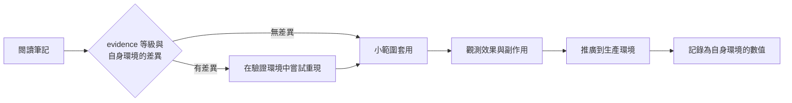
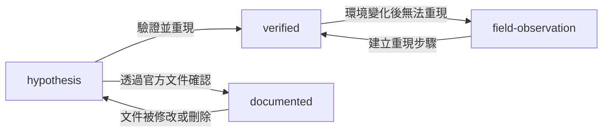

# 知識分類政策

<!-- lang-switcher:start -->
🌐 [日本語](../ja/evidence-policy.md) | [English](../en/evidence-policy.md) | [한국어](../ko/evidence-policy.md) | [简体中文](../zh-CN/evidence-policy.md) | [繁體中文](evidence-policy.md) | [Français](../fr/evidence-policy.md) | [Deutsch](../de/evidence-policy.md) | [Español](../es/evidence-policy.md) | [🏠 儲存庫首頁](README.md)
<!-- lang-switcher:end -->

---

## 結論

本儲存庫中的所有知識都帶有名為 `evidence` 的四級等級。讀者應依據該等級判斷**該項描述可以在多大程度上被信任並套用於自己的環境**。等級以機器可讀的形式寫入 frontmatter，`make lint` 會檢查各等級的必填中繼資料。

要提升等級（往可信度較高的一側移動），必須補上相應的證據。降級則始終自由。

---

## 四個等級

| 等級 | 含義 | 必填中繼資料 | 讀者應如何對待 |
|---|---|---|---|
| `verified` | 作者在所述環境中實際重現過 | `verified_on`（驗證日期）+ 正文中的驗證環境 | 在該環境條件下可以信任。條件不同則需重新驗證 |
| `documented` | 廠商或 AWS 官方文件中有記載 | `source`（URL 或文件名稱） | 可作為第一手資訊對待。但需注意版本與區域差異 |
| `field-observation` | 在現場觀測過一次，但未做重現確認 | 正文中明記「未確認可重現」 | 假設的線索。不得一般化 |
| `hypothesis` | 邏輯推導得出的推論，未經驗證 | 正文中明記「未驗證」 | 驗證的起點。不能作為判斷依據 |

---

## 等級沒有回答的問題

等級劃分的是**該敘述的來源**。**它不是追查程度，也不是確信度量表。** 與使用不同詞彙的儲存庫互相連結時，語意正是在這條邊界上發生偏移。

### `documented` 並不含有實測之意

`documented` 僅表示「廠商或 AWS 文件中有記載」。**它不包含作者親自確認過該行為的主張。** 主張實測的等級只有 `verified`。

因此「一次資料中有記載，但未在實機上追查」屬於 `documented`。**這樣的對應不會遺失資訊**，正因為 `documented` 本來就不含實測之意。若其他儲存庫把同一狀態稱作 `unverified` 之類，也可原樣對應到 `documented`。

### 文件的缺失不是一個等級

「查找過但未能在公開資料中找到記載」是**關於資料狀態的主張，而非關於產品行為的主張。** 四個等級都是對敘述依據的分類，都不表示依據的缺失。

尤其不要使用 `hypothesis`。`hypothesis` 意味著**存在經過推理得出的預期**。在沒有推理時使用它，會讓筆記看起來握有並不存在的依據。

應寫在正文中。**請註明查找日期與查找範圍** —— 例如「截至 2026-08，未在 AWS 官方文件中找到相關記載」—— 讓讀者能判斷你何時、在何處查找過。若屬於上限值或配額，可放在[上限值與配額](../ja/reference/limits/) (日本語)的 "Could not be measured" 一節（該文件標題以日文與英文並列）。

---

## 為何需要這樣的等級劃分

技術支援現場獲得的資訊，性質差異很大。

- 官方文件中寫明的內容
- 在驗證環境中重現的實測值
- 僅觀測過一次但未查明原因的行為
- 「大概是這樣」的推論

若以相同的語氣並列陳述，讀者無法區分。尤其是把**僅觀測過一次的行為**寫成一般規格，會導致讀者基於錯誤前提進行設計。明示等級，可使敘述的強度與證據的強度保持一致。

---

## 書寫數值時的必要條件

`verified` 的數值必須一併寫明量測條件。沒有條件的數值無法重現，而無法重現的數值不能用於判斷。

| 需一併記錄的項目 | 範例 |
|---|---|
| ONTAP 版本 | `9.17.1P7D1` |
| 區域 | `ap-northeast-1` |
| 組態 | 吞吐量設定、磁碟區類型、用戶端類型 |
| 量測方式 | 工具、並行度、檔案大小、執行次數 |
| 量測日期 | `2026-08-06` |

同時必須明確以下區分。

| 必須區分的內容 | 混淆後會發生什麼 |
|---|---|
| 樣本執行 vs 生產環境估算 | 單次量測值被當作容量規劃的依據 |
| 本驗證環境 vs 一般的服務上限 | 環境特有的數值被引用為服務規格 |
| 設計上的考量 vs 法務與合規判斷 | 指引性內容被當作法律依據 |
| AI 的輔助性提示 vs 最終判斷 | 自動判定結果未經人工確認即被確定 |

---

## 投入生產環境前的確認

等級只表示「可以信任到什麼程度」，**並不保證在您的環境中同樣成立。** 投入生產環境前，請依等級確認以下事項。

| 等級 | 投入生產前必做 |
|---|---|
| `verified` | 找出所述驗證環境與自身環境的差異。版本、區域、組態中任一不同即需重新量測 |
| `documented` | 實際開啟出處，確認現行版本是否仍有相同敘述。文件會被修訂 |
| `field-observation` | 確認在自身環境中是否可重現。若不可重現，該敘述不能作為前提 |
| `hypothesis` | 驗證後再使用。不要以未驗證的推論作為設計依據 |

### 套用步驟



| # | 步驟 | 目的 |
|---|---|---|
| 1 | 確認 `evidence` 等級與所述環境條件 | 掌握已驗證的範圍 |
| 2 | 寫出與自身環境的差異（版本 / 區域 / 組態 / 負載） | 確定需要重新驗證的範圍 |
| 3 | 在與生產相同組態的驗證環境中重現 | 避免在生產環境中才首次了解行為 |
| 4 | 限定影響範圍後套用並觀測 | 以小單位捕捉預期外的副作用 |
| 5 | 記錄自身環境中的結果 | 作為下次判斷的依據。若有差異，歡迎透過 [Issue](https://github.com/Yoshiki0705/FSx-for-ONTAP-Adoption-Playbook/issues) 分享 |

**不可逆的操作不能省略步驟 3。** 諸如啟用 SnapLock 這類無法回復的設定，請勿在未經驗證環境確認的情況下投入生產環境。

---

## 等級的升級與降級



| 轉移 | 所需工作 |
|---|---|
| → `verified` | 明記驗證環境並加入 `verified_on`。在正文中記載重現步驟 |
| → `documented` | 在 `source` 中加入 URL。逐字引用不超過 30 個詞，原則上應做摘要 |
| `verified` → `field-observation` | 在正文中補充無法重現的經過。數值不刪除，作為歷史保留 |
| → `hypothesis` | 明記依據喪失的原因 |

**降級並非品質下降。** 誠實地表明證據已經喪失，比放任過時的 `verified` 對讀者更安全。

---

## 常見誤解

| 誤解 | 實際情況 |
|---|---|
| `documented` 最可信 | 文件與實作可能存在落差。`verified` 是自身環境中的事實 |
| 只要是 `verified`，生產環境也會得到相同結果 | 那是驗證環境中的實測。生產的組態與負載不同，結果就會改變 |
| `field-observation` 不應收錄 | 有收錄價值。但不得一般化，並須明示未確認可重現 |
| 不提升等級就沒有價值 | 以 `hypothesis` 形式分享驗證的起點也具有價值 |

---

## frontmatter 的寫法

```yaml
---
title: SnapMirror の初期同期でスループットが出ない場合の切り分け
lifecycle: [migrate]
domains: [performance]
evidence: verified
verified_on: 2026-08-06
ontap_version: 9.17.1P7D1
region: ap-northeast-1
lang: ja
---
```

`make lint` 檢查的內容：

- 為 `evidence: verified` 時存在 `verified_on` 且不是未來日期
- 為 `evidence: documented` 時存在 `source`
- 為 `evidence: field-observation` 時正文中有相當於「未確認可重現」的敘述
- 為 `evidence: hypothesis` 時正文中有相當於「未驗證」的敘述
- `lifecycle` / `domains` 的取值包含在已定義的詞彙中

---

## 相關文件

- [導覽指南](navigation.md)
- [CONTRIBUTING.md](../../CONTRIBUTING.md)
- [AGENTS.md](../../AGENTS.md) — 面向 AI 代理的規約
- [儲存庫首頁](README.md)

---

<!-- lang-switcher:start -->
🌐 [日本語](../ja/evidence-policy.md) | [English](../en/evidence-policy.md) | [한국어](../ko/evidence-policy.md) | [简体中文](../zh-CN/evidence-policy.md) | [繁體中文](evidence-policy.md) | [Français](../fr/evidence-policy.md) | [Deutsch](../de/evidence-policy.md) | [Español](../es/evidence-policy.md) | [🏠 儲存庫首頁](README.md)
<!-- lang-switcher:end -->
