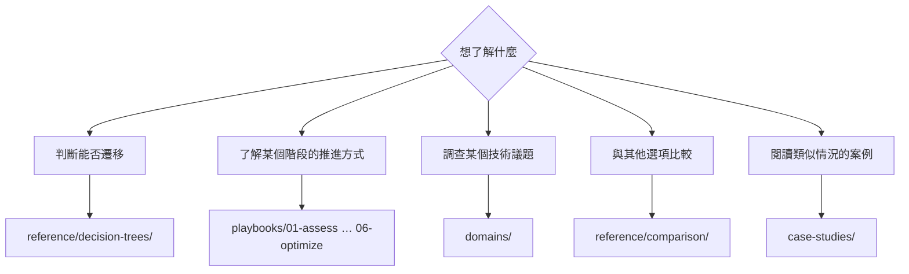

# 導覽指南

<!-- lang-switcher:start -->
🌐 [日本語](../ja/navigation.md) | [English](../en/navigation.md) | [한국어](../ko/navigation.md) | [简体中文](../zh-CN/navigation.md) | [繁體中文](navigation.md) | [Français](../fr/navigation.md) | [Deutsch](../de/navigation.md) | [Español](../es/navigation.md) | [🏠 儲存庫首頁](README.md)
<!-- lang-switcher:end -->

---

## 結論

入口有三個。**若為初次造訪，請從[從自己的環境查找](#從自己的環境查找)開始。** 選擇組態特徵即可決定閱讀順序。

若依專案進展查找，使用 `playbooks/`；若從議題查找，使用 `domains/`。兩條路徑都會抵達同一批筆記。當存在多個選項而難以決定時，請從 `reference/decision-trees/` 開始。

---

## 從哪裡開始讀

---

## 從自己的環境查找

上面的分支從「想了解什麼」開始。若想依**「以我的組態該讀哪裡」**查找，請使用此表。左側是自身環境的特徵，右側是閱讀順序。

| 自身環境的特徵 | 先讀 | 再讀 |
|---|---|---|
| 遷移來源為 ONTAP（地端 / 其他雲） | [遷移方式決策樹](../ja/reference/decision-trees/migration-method.md) (日本語) | [評估](../en/playbooks/01-assess/) → [設計](../en/playbooks/02-design/) (English) |
| 遷移來源為 Windows 檔案伺服器（要求保留 SMB / NTFS ACL） | [遷移方式決策樹](../ja/reference/decision-trees/migration-method.md) (日本語) | [多協定與身分](../en/domains/multiprotocol-identity/) (English) |
| 遷移來源為非 ONTAP 的 NAS | [遷移方式決策樹](../ja/reference/decision-trees/migration-method.md) (日本語) | [評估](../en/playbooks/01-assess/) (English) |
| 對同一份資料同時使用 NFS 與 SMB | [安全樣式決定權限評估模型](../ja/domains/multiprotocol-identity/notes/security-style-and-permission-evaluation.md) (日本語) | [安全與治理](../en/domains/security-governance/) (English) |
| 以 Active Directory 整合為前提 | [多協定與身分](../en/domains/multiprotocol-identity/) (English) | [設計](../en/playbooks/02-design/) (English) |
| 全新建置（無遷移來源） | [設計](../en/playbooks/02-design/) (English) | [建置](../en/playbooks/04-build/) → [運維](../en/playbooks/05-operate/) (English) |
| 已在運行，希望調整效能 | [效能](../en/domains/performance/) (English) | [最佳化](../en/playbooks/06-optimize/) (English) |
| 已在運行，希望重新檢視成本 | [成本](../en/domains/cost/) (English) | [最佳化](../en/playbooks/06-optimize/) (English) |
| 想確認設計是否觸及上限值 | [上限值與配額](../ja/reference/limits/) | [設計](../en/playbooks/02-design/) (English) |
| 想透過 S3 API 或分析平台存取 | [FSx for ONTAP S3 AP 的前提條件](../ja/domains/data-utilization/notes/s3-access-point-constraints.md) (日本語) | [存取點政策的寫法](../en/domains/security-governance/notes/access-point-policy-allow-is-not-a-cap.md) (English) |

關於上述連結，有兩點需要了解。

| 標記 | 應有的預期 |
|---|---|
| **(日本語)** / **(English)** | 尚無繁體中文版。深入的資料僅存在於日語與英語。URL、指令與產品術語與語言無關 |
| `reference/` 連結，無標記 | 日語與英語並列於同一檔案，可直接閱讀 |

歡迎透過 [Issue](https://github.com/Yoshiki0705/FSx-for-ONTAP-Adoption-Playbook/issues) 提出翻譯請求。

**無論哪一列，都不要將讀到的內容直接套用於生產環境。** 請確認每則筆記的 `evidence` 等級，並走完[投入生產環境前的確認](evidence-policy.md#投入生產環境前的確認)步驟。

---

## 生命週期軸 — `playbooks/`

沿專案進展的入口。上一階段的產出即下一階段的輸入。連結指向英語版。

| # | 模組 | 主要產出 | 再讀 |
|---|---|---|---|
| 01 | [評估](../en/playbooks/01-assess/) | 現狀清單、限制條件列表 | 02 設計 |
| 02 | [設計](../en/playbooks/02-design/) | 組態決策、確定不可逆項目 | 03 遷移 |
| 03 | [遷移](../en/playbooks/03-migrate/) | 遷移計畫、切換程序、回復程序 | 04 建置 |
| 04 | [建置](../en/playbooks/04-build/) | IaC、自動化、建置後驗證 | 05 運維 |
| 05 | [運維](../en/playbooks/05-operate/) | 監控設計、Runbook | 06 最佳化 |
| 06 | [最佳化](../en/playbooks/06-optimize/) | 效能與成本的改善結果 | — |

---

## 主題軸 — `domains/`

從議題查找的入口。貫穿各生命週期階段被引用。連結指向英語版。

| 模組 | 典型問題 |
|---|---|
| [資料保護](../en/domains/data-protection/) | 如何設計 Snapshot / 是否真的能復原 |
| [資料活用](../en/domains/data-utilization/) | 能否在不增加副本的前提下用於分析與 AI |
| [安全與治理](../en/domains/security-governance/) | 如何設計加密、稽核與權限 |
| [效能](../en/domains/performance/) | 吞吐量在哪裡決定、在哪裡被共用 |
| [成本](../en/domains/cost/) | 估算與實測為何出現落差 |
| [多協定與身分](../en/domains/multiprotocol-identity/) | NFS 與 SMB 的權限為何不一致 |

---

## 橫向參考 — `reference/`

日語與英語並列於同一檔案。

| 目錄 | 使用場景 |
|---|---|
| [決策樹](../ja/reference/decision-trees/) | 存在多個選項，需要決定選哪一個 |
| [比較矩陣](../ja/reference/comparison/) | 需要整理與其他選項之間的取捨 |
| [上限值與配額](../ja/reference/limits/) | 需要確認設計不會觸及上限 |
| [術語表](../ja/reference/glossary/) | 需要確認 ONTAP / AWS 術語的定義 |

## 實作工作坊的實施 — `workshop-studio/`

| 目錄 | 使用場景 |
|---|---|
| [`workshop-studio/`](../ja/workshop-studio/) | 將 AWS Workshop Studio 公開研討會壓縮至活動實際時長所需的實測耗時與模組取捨 (日本語) |

---

## 案例 — `case-studies/`

[Case Studies](../en/case-studies/) 將技術支援現場獲得的知識作為**一般化的教訓**收錄。其中不包含任何企業名稱、組織名稱、真實識別碼，也不包含可識別組織的組態。

案例依以下格式撰寫。

| 章節 | 內容 |
|---|---|
| 情況 | 僅產業與規模區間（例如：製造業 / 數百 TB 規模） |
| 課題 | 問題出在哪裡 |
| 考量過的選項 | 未採用的方案及其理由 |
| 判斷 | 選擇了什麼，基於什麼理由 |
| 結果 | 實際發生了什麼（包含與預期不符之處） |
| 可一般化的教訓 | 可移轉到其他環境的部分 |

---

## 如何解讀知識的可信度

每則筆記的 frontmatter 都帶有 `evidence` 等級。**未確認該等級前請勿引用。**

| 等級 | 一句話說明 |
|---|---|
| `verified` | 作者已在所述環境中重現 |
| `documented` | 官方文件中有記載 |
| `field-observation` | 僅觀測過一次，未確認可重現。不可一般化 |
| `hypothesis` | 未經驗證的推論 |

詳情請參閱[知識分類政策](evidence-policy.md)。

---

## 常見誤解

| 誤解 | 實際情況 |
|---|---|
| `playbooks/` 與 `domains/` 持有不同的資訊 | 它們從兩個軸引用同一批筆記。不是重複，而是多條通路 |
| 數值可以直接用於自己的環境 | 數值與其量測環境成對。條件不同就需要重新驗證 |
| 案例中會寫明具體組態 | 已刻意抽象化。不會寫入可識別組織的資訊 |
| 上限值始終是最新的 | `reference/limits/` 的項目附有驗證日期。日期較舊的項目請重新確認 |

---

## 相關文件

- [知識分類政策](evidence-policy.md)
- [CONTRIBUTING.md](../../CONTRIBUTING.md) — 寫作規約
- [AGENTS.md](../../AGENTS.md) — 面向 AI 代理的規約
- [llms.txt](../../llms.txt) — 面向 LLM 的儲存庫地圖

---

<!-- lang-switcher:start -->
🌐 [日本語](../ja/navigation.md) | [English](../en/navigation.md) | [한국어](../ko/navigation.md) | [简体中文](../zh-CN/navigation.md) | [繁體中文](navigation.md) | [Français](../fr/navigation.md) | [Deutsch](../de/navigation.md) | [Español](../es/navigation.md) | [🏠 儲存庫首頁](README.md)
<!-- lang-switcher:end -->
